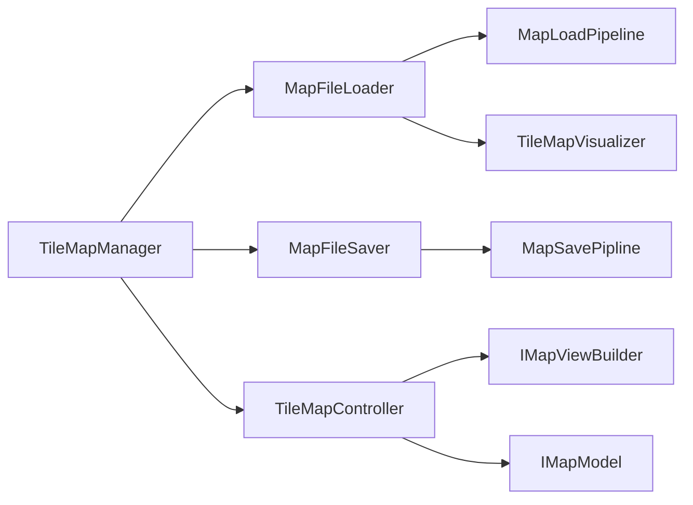

# Components — MonoBehaviour 진입점

씬에 직접 붙는 4개의 MB. 실제 로직은 `TileMap/`에 위임.
`TileMapManager`가 나머지 3개를 조율합니다.



---

## TileMapManager — 생명주기 조율자

```
Start()
  1. _loader.Load()
  2. _controller.Init(model, viewBuilder)
  3. _saver.Init(model)

Save() → _saver.Save()
```

인스펙터: `_loader`, `_saver`, `_controller` (모두 동일 GameObject 또는 자식 MB)
외부 참조: `Model` 프로퍼티로 `IMapModel` 노출 (예: `CharacterVisibilityBroadcaster`)

---

## MapFileLoader — 파일 → 모델 로드

```
Load()
  1. TileMapSerializer.Read(path)   → MapSaveJsonDto
  2. TileMapDtoMapper.ToPrepared()  → MapModelDTO
  3. TileMapModelBuilder.Build()    → IMapModel
  4. new TileObjFactory(transform, prefabDB)
  5. new TileMapVisualizer(factory) → IMapViewBuilder
```

인스펙터: `prefabDB` (ScriptableObject), `fileName` (JSON), `usePersistentPath` (bool)
노출: `Model`, `ViewBuilder` 프로퍼티 (TileMapManager가 회수)

---

## MapFileSaver — 모델 → 파일 저장

```
Init(IMapModel)         ← TileMapManager에서 주입
Save()                  → MapSavePipline.Save(path)
                           or SaveAsync()       ← UniTask 스레드풀
                           or SaveSafeAsync()   ← Newtonsoft 스트리밍 (대용량)
```

인스펙터: `fileName`
에디터 전용: `SaveInEditor()` ContextMenu — 씬 현재 TileView 스냅샷 저장

---

## TileMapController — 타일 편집 및 뷰 갱신

```
Init(model, viewBuilder)  ← TileMapManager에서 주입
                             viewBuilder.Bind(model)  ← 이벤트 구독
                             viewBuilder.Build(model) ← 초기 렌더

MarkDirty(Vector3Int)     → _dirty 셋 추가 (배치)
FlushDirty()              → 모든 dirty 셀 순회
RefreshCell(pos)          → 모델 조회 → IMapViewBuilder.RefreshCell()
```

모델을 직접 수정하지 않음. 로드/저장을 알지 못함.
