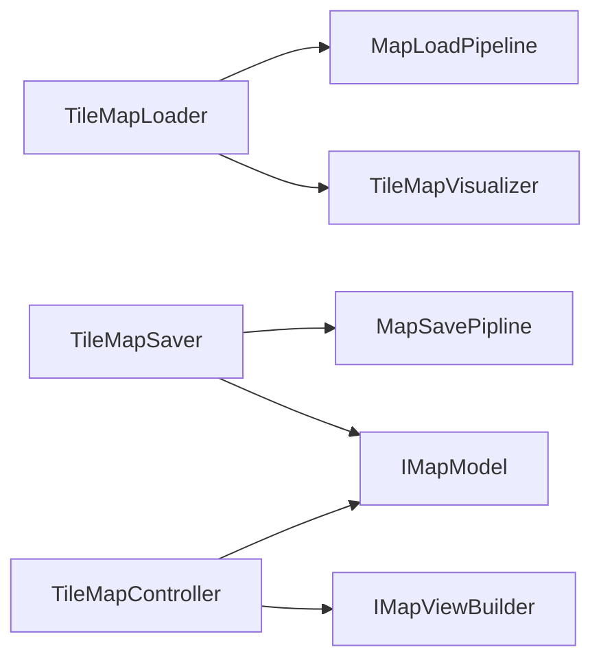

# Components — MonoBehaviour 진입점

씬에 직접 붙는 3개의 MB. 실제 로직은 `TileMap/`에 위임.



---

## TileMapLoader — 초기화 진입점

```
LoadMapRuntime()
  1. TileMapSerializer.Read(path)   → MapSaveJsonDto
  2. TileMapDtoMapper.ToPrepared()  → MapModelDTO
  3. TileMapModelBuilder.Build()    → IMapModel
  4. new TileObjFactory(transform, prefabDB)
  5. new TileMapVisualizer(factory)
  6. visualizer.Bind(model)         ← 이벤트 구독
  7. visualizer.Build(model)        ← 초기 렌더
```

인스펙터: `prefabDB` (ScriptableObject), `fileName` (JSON), `usePersistentPath` (bool)
에디터 전용: `SaveMapInEditor()` — 씬 현재 타일 스냅샷 저장

---

## TileMapSaver — 저장 진입점

```
SaveMap() → MapSavePipline.Save(path)
            or SaveAsync()       ← UniTask 스레드풀
            or SaveSafeAsync()   ← Newtonsoft 스트리밍 (대용량)
```

인스펙터: `_model`, `_modelBuilder`, `_mapper`, `fileName`

---

## TileMapController — 런타임 뷰 갱신

```
MarkDirty(Vector3Int)   → _dirtySet 추가 (배치)
FlushDirty()            → 모든 dirty 셀 순회
RefreshCell(pos)        → 모델 조회 → IMapViewBuilder.RefreshCell()
```

모델을 직접 수정하지 않음. 뷰 갱신만 담당.
