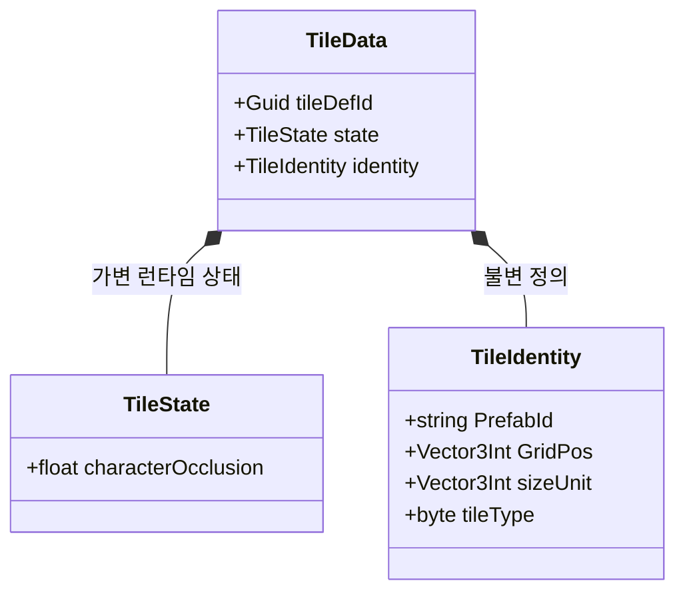

# Internal — 핵심 데이터 구조체

Unity 비의존 순수 구조체. 시스템 전체에서 공유.

---

## 필드 메모

| 필드 | 설명 |
|------|------|
| `tileDefId` | Guid — 런타임 바인딩 키. 저장하지 않으며 로드 시 `Guid.NewGuid()`로 생성. `TileMapVisualizer`가 TileData → TileView를 찾을 때 사용 |
| `characterOcclusion` | BFS 후보 여부 안에서 플레이어와 거리 등으로 표시 차단 정도 결정 (`0`=해제) |
| `PrefabId` | `TilePrefabDB` 딕셔너리 키 |
| `sizeUnit` | 점유 그리드 크기 (예: `2,1,1`) |
| `tileType` | `1`=Floor, `2`=Wall, `3`=Obstacle |
