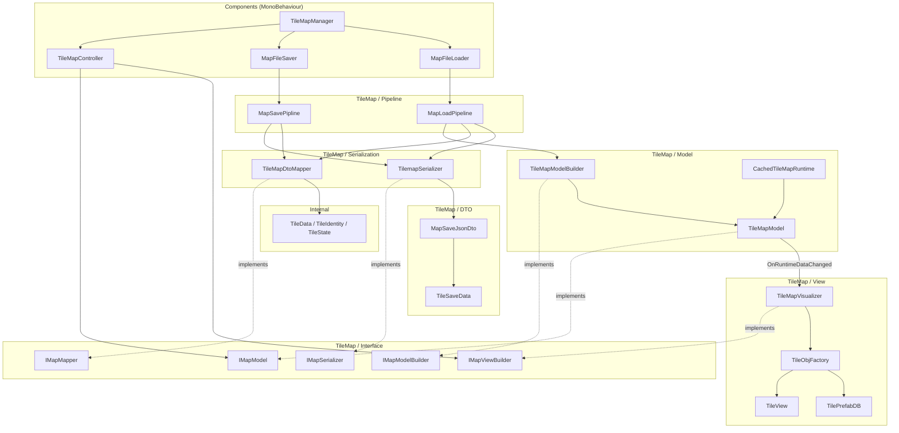
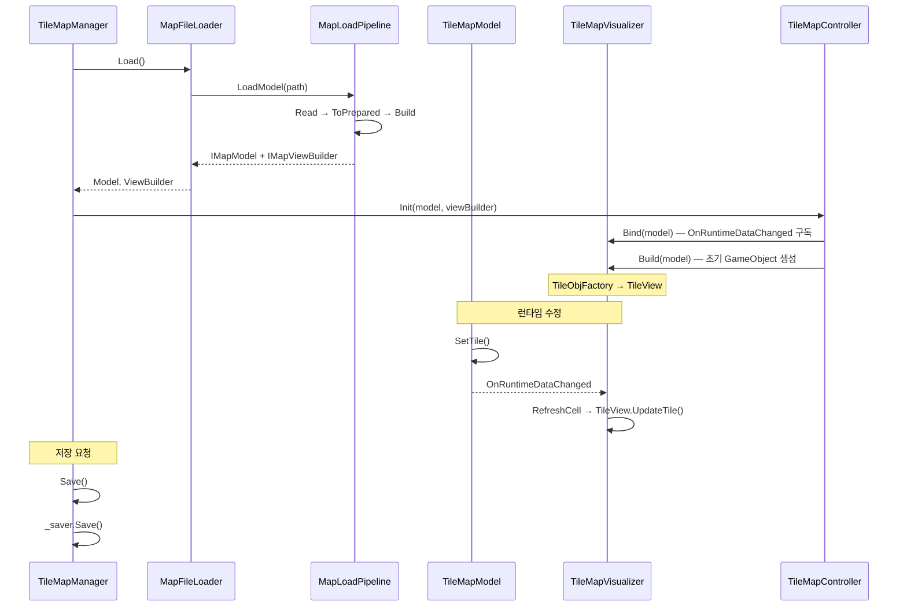

# Map System — 전체 개요

패턴: MVC + Pipeline + Observer
세부 문서: [COMPONENTS.md](Components/COMPONENTS.md) | [DATA.md](Internal/DATA.md) | [TILEMAP.md](TileMap/TILEMAP.md)

---

## 의존성 다이어그램

---

## 데이터 흐름 요약

---

## 레이어별 역할

| 레이어 | 위치 | 역할 |
|--------|------|------|
| Coordinator | `Components/` | `TileMapManager` — 생명주기 조율, wiring |
| Entry | `Components/` | `MapFileLoader`, `MapFileSaver`, `TileMapController` |
| Data | `Internal/` | 순수 구조체 (Unity 비의존) |
| Interface | `TileMap/Interface/` | 레이어 간 계약, 결합도 최소화 |
| DTO | `TileMap/DTO/` | JSON 직렬화 전용 포맷 |
| Model | `TileMap/` | 런타임 상태, BFS 오클루전 |
| View | `TileMap/` | GameObject 생성·갱신 |
| Pipeline | `TileMap/` | 단계 조합 (교체 가능) |
