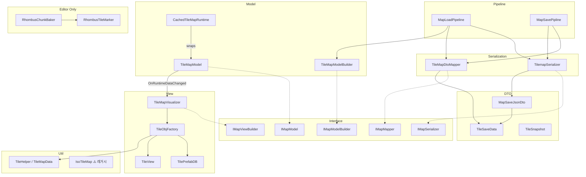

# TileMap — 핵심 로직

## 내부 의존성 다이어그램



---

## 파일별 역할

### Interface
- **MapInterfaces.cs** — `IMapModel`, `IMapModelReadOnly`, `IMapViewBuilder`, `IMapSerializer`, `IMapMapper`, `IMapModelBuilder` 정의

### DTO
- **MapSaveJsonDto.cs** — JSON 루트 (`List<TileSaveData>`)
- **TileSaveData.cs** — 타일 1개 직렬화 (`x,y,z`, `sizeX,Y,Z`, `prefabId`, `tileType`)
- **TileSnapshot.cs** — 셀 스냅샷 (읽기 전용, 뮤테이션 없음)

### Model
- **TileMapModel.cs** — `Dictionary<Vector3Int, List<TileData>>`, 이벤트, BFS 오클루전
- **TileMapModelBuilder.cs** — `MapModelDTO → new TileMapModel().Initialize()`
- **CachedTileMapRuntime.cs** — Decorator, `GetOccludingWalls()` 결과 캐시

### Serialization
- **TilemapSerializer.cs** — `JsonUtility` 기반 파일 읽기/쓰기
- **TileMapDtoMapper.cs** — `MapSaveJsonDto ↔ MapModelDTO` 변환

### Pipeline
- **MapLoadPipeline.cs** — Read → ToPrepared → Build 조합
- **MapSavePipline.cs** — `Save()` / `SaveAsync()` / `SaveSafeAsync()` (Newtonsoft 스트리밍)

### View
- **TileMapVisualizer.cs** — `Dictionary<Guid, TileView>` 추적, Bind/Build/RefreshCell. Model이 이벤트로 보낸 `TileData.tileDefId`로 대응하는 TileView를 조회해 업데이트
- **TileObjFactory.cs** — PrefabDB 조회 → Instantiate → TileView 초기화
- **TilePrefabDB.cs** — ScriptableObject, `string → GameObject` 캐시
- **TileView.cs** — 타일 MB, `UpdateTile()`, 씬뷰 기즈모

### Util
- **TileMapData.cs** (클래스: TileHelper) — `WorldToGrid` / `GridToWorld` 변환
- **IsoTileMap.cs** — ⚠️ 레거시, 현재 미사용

### Editor Only
- **RhombusChunkBaker.cs** — 자식 타일 → 단일 MeshCollider 베이킹 (1×1만 지원)
- **RhombusTileMarker.cs** — 베이킹 대상 마커 (빈 MB)

### Debug
- **Debug/DebugTileRunner.cs** — BFS 기즈모 콜백 홀더 (`IFrameState`)

---

## 레이어 설계 원칙

| 레이어 | 알아도 되는 것 | 알면 안 되는 것 |
|--------|--------------|----------------|
| **Model** (`TileMapModel`) | `TileData` (순수 데이터) | `TileView`, `GameObject` 등 뷰 일체 |
| **Visualizer** (`TileMapVisualizer`) | `TileData`, `TileView`, `Guid` 매핑 | Model 내부 구현 |
| **View** (`TileView`) | 자신의 시각 상태 | `TileData`, Model |

`tileDefId`는 Model과 Visualizer 사이의 계약 — Visualizer가 어떤 TileView를 갱신해야 하는지 찾기 위한 런타임 전용 키.

---

## BFS 오클루전 알고리즘 (TileMapModel.GetOccludingWalls)

```
입력: playerPos (Vector3Int)
1. playerPos 기준 XZ 평면 BFS 플러드 필
2. 접근 가능한 빈 셀 수집 (최대 200,000회 안전 제한)
3. 빈 셀 인접 Wall 타일 선별
4. 전방/좌측에 Floor가 있는 벽만 반환 ("숨길 수 있는" 벽)
출력: 숨김 처리할 TileData 목록
```
