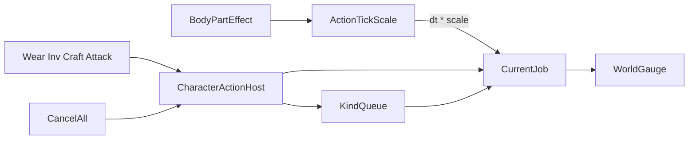

# Character Action (게이지·큐)

> LLM/에이전트용 행위자 행동 직렬화 SSOT.
> 인덱스: [`docs/README.md`](../README.md)
> 관련: [`DEFINITION.md`](DEFINITION.md) · [`../body/BODY.md`](../body/BODY.md) · [`../ui/SETTINGS.md`](../ui/SETTINGS.md) · [`../equipment/GEAR.md`](../equipment/GEAR.md) · **파이프라인 매뉴얼** [`../equipment/COMBAT_PIPELINE.md`](../equipment/COMBAT_PIPELINE.md)

경로: `Assets/Dist/Scripts/Entity/Character/CharacterActionHost.cs`  
지연: `CharacterActionDelayCatalog` / `CharacterActionDelay` (`Dist.Gameplay.Data`)  
UI: `Assets/Dist/Visual/Prefabs/UIComponents/Character/Grp_CharacterActionGauge.prefab`  
Patch: `Dist/MCP/Character/Patch Action Gauge On Player`

게이지·큐·취소는 **그 행동을 하는 행위자 GO**에 붙는다. 플레이어 전역/`GameplayData` 아님.

---

## 계약 (패리티)

| Before | After |
|--------|--------|
| 장비 타이머·인벤 이동·전투 쿨·제작이 겹칠 수 있음 | 같은 행위자에서 **한 줄만** 진행. Gear/Inv/Cell은 선점, Craft는 큐 |
| busy면 거절 | `TryRunImmediate` — idle이면 즉시 Start, busy면 현재 CancelSoft 후 시작. Craft만 `TryEnqueue` |
| ESC가 행동을 안 끊음 | possessed만 `CancelAll` (현재 작업+큐). Combat **동작 busy**는 스킵. **무기 쿨은 ActionHost와 무관** |
| 상태이상이 행동 시간에 무관 | `BodyPartEffect` → `TickScale`을 실제 dt에 곱함 |

```text
요청 → CharacterActionHost.TryRunImmediate (기본) / TryEnqueue (Craft·Combat 연타)
         idle  → Start
         busy  → Immediate: 현재 CancelSoft + 큐 flush 후 Start
                 Enqueue: 종류별 EnqueueOrReplace
         완료  → dequeue 다음 Start
CancelAll → 현재 작업 취소(적용 없음) + 큐 전부 폐기. Combat 동작 busy는 스킵.
            무기 쿨은 Attacker 손 슬롯에 남음 (ActionHost 아님).
```

종류별 큐 정책 (`EnqueueOrReplace`) — 이산 작업과 연타 입력을 같은 FIFO에 넣지 않는다.

### `CharacterActionKind.Cell` (구 Map)

행동큐 **종류 태그** — 맵 로드·타일맵 API(`MapVaultQuery` 등)와 이름을 섞지 않는다.

| 소비자 | 역할 |
|--------|------|
| `CharacterArriveHost` | 셀/월드 목표 자동이동 |
| `CharacterActionHost` Cell pipelines | 농사·낚시·건설 (`CharacterCellFarmPipeline` / Fish / Construction) |
| `CharacterVaultHost` | vault |

### Work Layer (Cell 소비자 공통)

| 항목 | SSOT |
|------|------|
| 레이어 이름 | `CharacterWorkLayerAnim.LayerName` (Animancer debug name) |
| 재생 API | `CharacterWorkLayerAnim.TryPlay` / `Stop` → Animancer `Layers[Work]` **Play(clip)** (S6) |
| 소유권 | `CharacterLocomotionWorkAnimancer` + CLA. Animancer Work layer (S7; Mecanim Work non-SSOT) |
| 컨트롤러 remnant | `CharacterWorkLayerAnim.DefaultControllerPath` — S7 전 Ensure/Rebuild 가능하나 **재생 필수 아님** |
| 에이전트 | Unity MCP `Dist/MCP/Ensure Work Layer`는 remnant 유지용. MCP 꺼짐·오류 시 → **MCP 복구 요청** |
| Play 진입 검사 | `WorkLayerPlayModeContractGuard` — **카탈로그 AnimationClip 존재** (Mecanim state 이름 일치 불필요) |
| 런타임 검사 | `CharacterWorkLayerAnim.ValidateOrLog` — Animancer Work 능력 |

S6: Animancer가 클립을 **직접** Play한다. `clip.name` = Animator 상태 이름 계약은 **재생에 더 이상 필요하지 않다** (동작명 파라미터 추가 금지는 유지).

| Kind | busy일 때 | 이유 |
|------|-----------|------|
| Gear / Inventory / Cell | Immediate 선점 (CancelSoft + 큐 flush) | 클릭 = 지금 이 작업. 이전 작업은 미적용 취소. **Cell** = 그리드/월드 셀 스크립트 행동 (`CharacterArriveHost` 도착 · ActionHost Cell pipeline 작업 · vault). Arrive 중 게이지는 `Img_AutoProgressIcon`. TileMap 시스템과 무관 |
| Craft | FIFO append | busy면 예약. 클릭 1 = 작업 1 |
| Combat | 큐에 **최대 1개**. 이미 Combat이 있으면 Start만 교체 | LMB 연타는 “지금 한 대”이지 N대 예약이 아님. **동작 busy**(pending cue + 동작 쿨)만 ActionHost. **무기 쿨은 손/무기 게이트·슬롯 fill만** |

교차 종류 Immediate: 착용 중 벗기 = 착용 취소 후 벗기. Combat 동작 busy 중 Gear = 동작 busy 취소(무기 쿨 유지) 후 Gear. 무기 쿨만 남은 동안은 ActionHost idle → 벗기/삽탄 즉시.

**머리 위 게이지** (`Grp_CharacterActionGauge`): `ICharacterActionSource.Progress01`. Combat 분기는 `CharacterAttacker.ActionPerformProgress01` (동작 진행). 무기 쿨을 올리지 않음.

**손 슬롯 fill**: `GetCooldownOverlay01` — 동작·무기 쿨 **반영만**. 메뉴 disabledReason·선점 판단에 쓰지 않음.

**Dig** / **Chop**은 Combat perform 계열(홀드·Structure pipeline). 표·핸들러: [`COMBAT_PIPELINE.md`](../equipment/COMBAT_PIPELINE.md). 맵 파괴: [`DIG.md`](../map/DIG.md).

### 플레이어 조준·시전 3층 파이프라인

표·driver·Leaf↔handler·Catalog Resolve: **[`COMBAT_PIPELINE.md`](../equipment/COMBAT_PIPELINE.md)** (이 절은 ActionHost와의 경계만).

| Layer | SSOT | 역할 |
|-------|------|------|
| 1 조준 해석 | `IAimSightProvider` sample + `CharacterSightHost` | 입력은 sample 제안. 본체 Free/StructureLock으로 구독. 플레이어 진입=`SessionSightHost` |
| 2 시전 입력 | `ICombatPerformDriver` + `ICombatAttackInput` | Host = `PlayerCombatController` |
| 3 cue 실행 | `CharacterAttacker` · `IActionHandler` | Leaf `logicId` |

애니 `_attackActionQueue`(길이 2, 초과 drop)와 별개. Combat 연타 큐 정책은 위 Kind 표.

```text
현재 Gear, Combat 연타 → 큐 [Combat×1]
현재 Combat, 큐 비움, 클릭 → 큐 [Combat] (버퍼 1)
현재 Combat, 큐 [Combat], 클릭 → 그 잡 Start만 교체
현재 Combat, 큐 [Inv], 클릭 → 큐 [Inv, Combat]
```



타이머 **식**은 Host에 복붙하지 않는다. Start 콜백이 기존 시스템을 켠다. 완료는 해당 소스 idle 전이.

---

## TickScale

`CharacterActionDelay.TickScale(body)` — 트리 효과 순회, catalog 배율을 intensity만큼 곱. 미등록 1. 그다음 `BodyCapacity.ManipulationTickScale` 한 번 곱. 하한 `MinTickScale`.

적용: GearTimedAction, InventoryTimedMove, 전투 **동작 쿨**, 제작 경과. 무기 쿨도 Attacker Tick에서 같은 `ActionTickScale`을 곱하지만 ActionHost busy가 아님. 이동 속도(`BodyLocomotionPenalties`)와 별개. Feeling/습윤/과적은 후속 가산.

---

## CancelAll

모든 Host 공통. Combat **동작 busy**는 남긴다(ESC가 스윙/동작 쿨을 끊지 않음). 무기 쿨은 원래 ActionHost 밖. 작업/큐가 있으면 그것만 취소. 다른 Kind의 `TryRunImmediate`는 Combat `CancelSoft` → `ClearActionBusy`(pending·동작 쿨만, 무기 쿨 유지).

possessed ESC: `CharacterActionCancelConsumer` → `UiCancelPriority.CharacterAction` (60). 메뉴(100)가 먼저. 다른 오브젝트 큐를 ESC가 끊지 않음.

---

## UI

월드 캔버스 fill. idle이면 Canvas 비활성. 레이아웃은 프리팹 SSOT (`CharacterActionGaugeLayout`은 Patch 수치). 라벨/TMP 없음. 정면은 `WorldBillboard` (기본 Realtime, Inspector 토글).

---

## 검증

IsoLand `>PlayerCharacter`: 착용 중 벗기/인벤 드롭은 **선점**. 제작 busy만 큐. ESC는 미적용+큐 소멸(Combat 동작 busy·무기 쿨은 남김). 컨텍스트 메뉴 ESC는 메뉴만. 무기 쿨만 남은 동안 삽탄·벗기 메뉴는 클릭 가능. 조준 중 LMB 연타 → 쿨 끝난 뒤 **한 대만** (손 뗀 뒤 지연 연타 없음).
