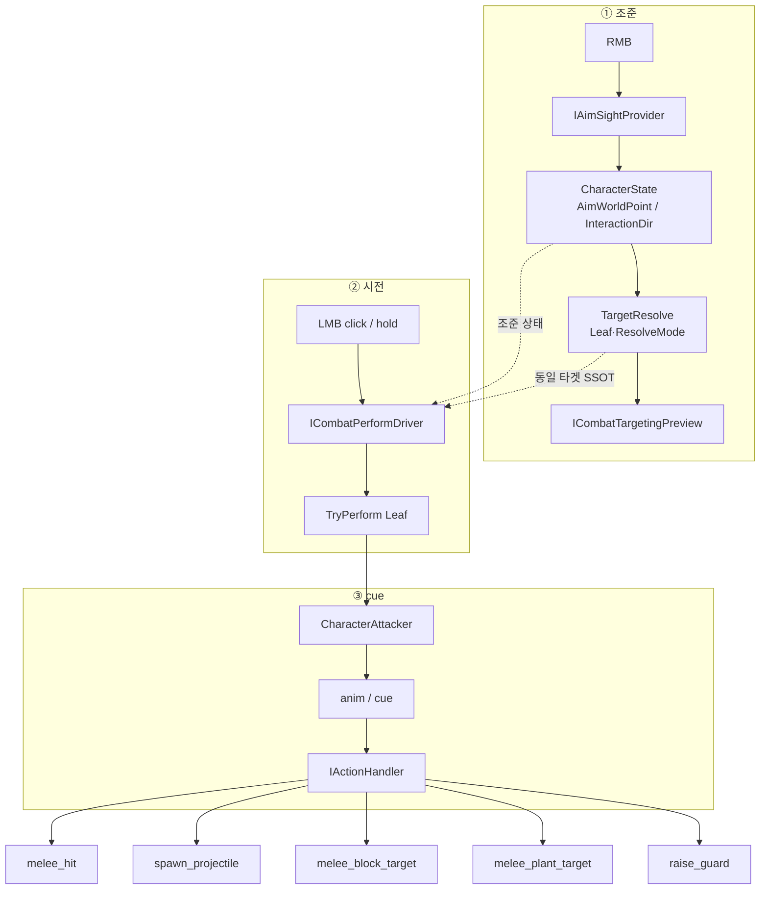
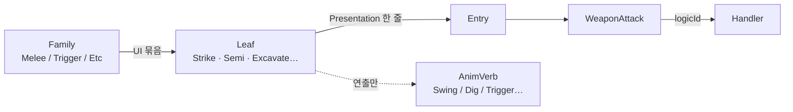
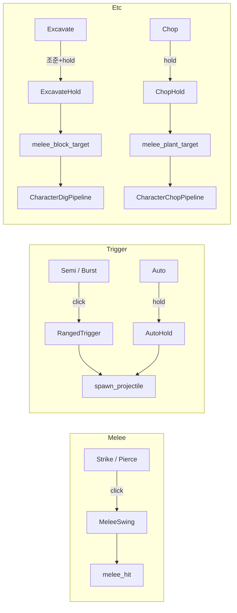
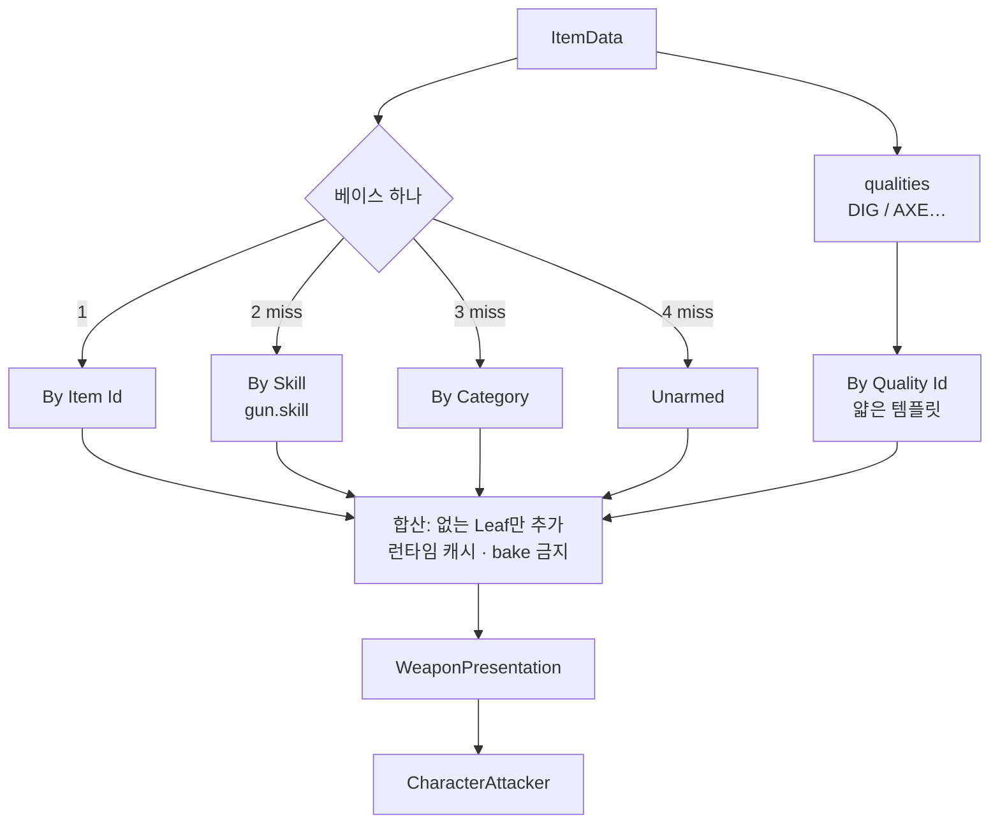

# Combat Pipeline

세부: [`ACTION`](../character/ACTION.md) · [`GEAR`](GEAR.md) · [`WEAPON_VISUAL`](WEAPON_VISUAL.md) · [`DIG`](../map/DIG.md)

---

## 전체



### Layer1 조준 3단

| 단 | 역할 | Excavate |
|----|------|----------|
| **Sight** | 시선·월드점. **입력**(`PlayerAimController` RMB) + `IAimSightProvider`. **Flatten Y**는 `CombatAimSightPolicy`. Dig LMB 잠금 시 `CombatAimSightHoldLock`(캐스트 스킵·SightDir=블록, 카메라 자유) | AimWorldPoint Y 유지 · 홀드 중 SightDir 고정 |
| **Resolve** | typed 타겟 + 사거리 clamp | `DigTileTargetResolver.TryResolveFromCombatAim` (발끝 transform→목표 셀 중심 월드 유클리드 ≤ `DigActionRangeCells × cellSize`) |
| **Preview** | 피드백 consumer | `MeleeBlockAimPreview` → `TilePresentationSystem.SetDigHighlight` |

`ICombatTargetingPreview`는 `ICombatPerformDriver`와 대칭 — `PlayerCombatController`가 perform Tick **이후** preview Tick. 원거리 Preview는 `UIAimPointer` + `TryPreviewRangedSpread` (후속 `RangedAimPreview` 이주 가능). Farm/건설 셀 세션은 입력·확정이 달라 합치지 않음.

---

## 이름 계층



**동작 SSOT = logicId.** Leaf는 선택 칸, AnimVerb는 팔 클립.

---

## Leaf → 입력 → Handler



---

## Presentation 어디서 오나



---

## 코드 위치

```text
Aim/          ① Sight (IAimSightProvider · CombatAimSightPolicy · CombatAimSightHoldLock)
Targeting/    ① Preview (ICombatTargetingPreview)
Perform/      ②  PlayerCombatController
Combat/       ③  CharacterAttacker · Handlers · Catalog
Map/Dig/      Resolve (DigTileTargetResolver · DigTileTargetAimPose) · Dig·Chop Pipeline
```

Data Definitions: **Combat** 루트 허브 → ① Catalog → ② Baselines/Quality → ③ Attacks → ④ Fallbacks. Catalog·허브에 Resolve 미리보기.
