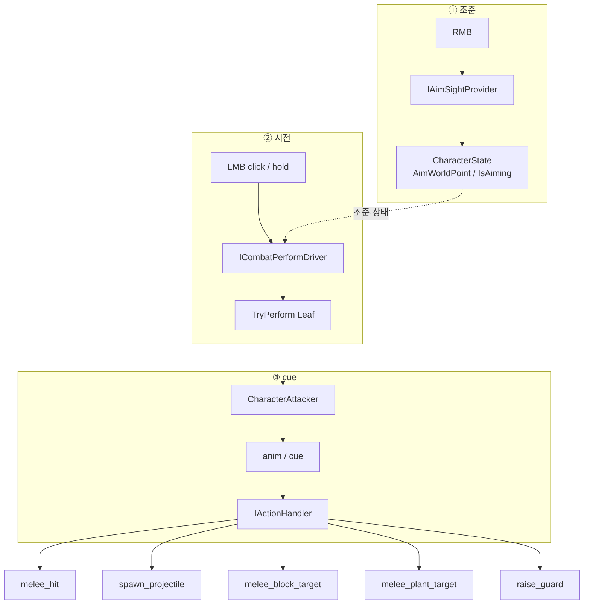
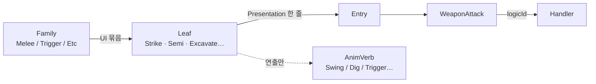
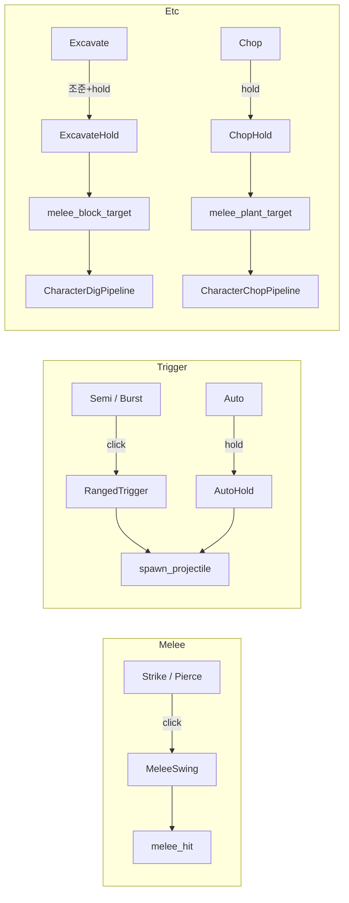
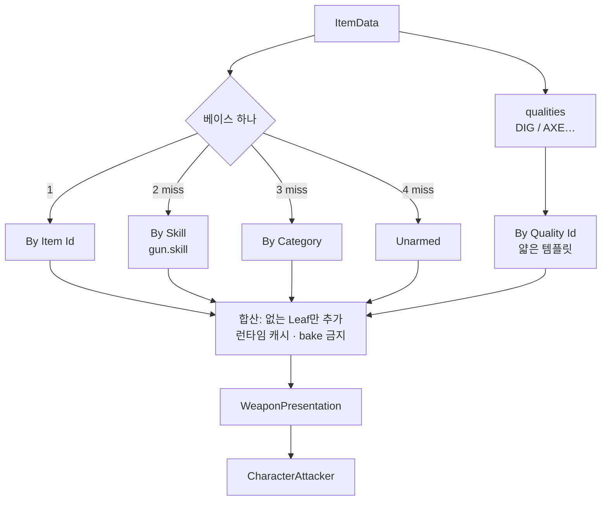

# Combat Pipeline

세부: [`ACTION`](../character/ACTION.md) · [`GEAR`](GEAR.md) · [`WEAPON_VISUAL`](WEAPON_VISUAL.md) · [`DIG`](../map/DIG.md)

---

## 전체



---

## 이름 계층



**동작 SSOT = logicId.** Leaf는 선택 칸, AnimVerb는 팔 클립.

---

## Leaf → 입력 → Handler



---

## Presentation 어디서 오나



---

## 코드 위치

```text
Aim/          ①
Perform/      ②  PlayerCombatController
Combat/       ③  CharacterAttacker · Handlers · Catalog
Character/Cell/   Dig·Chop Pipeline
```
