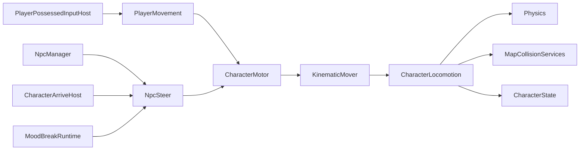
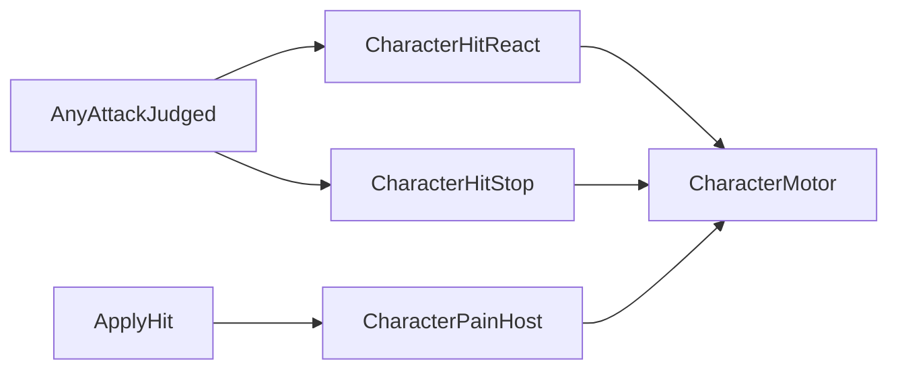

# Character Locomotion

> LLM/에이전트용 Dist 이동 SSOT.
> 인덱스: `docs/README.md` · 룰: `.cursor/rules/locomotion.mdc`
> **Locomotion 스크립트를 쓰거나 고치기 전에 이 문서를 읽는다.**
> 수영·잠수·산소: [`SWIM.md`](SWIM.md)
> 담넘기·벽넘기: [`VAULT.md`](VAULT.md) (ThickWall 위로 올리려면 상단 `ProvidesLogicalFloor` — 문서 「두꺼운 벽」절)

경로(코드): `Assets/Dist/Scripts/Entity/Locomotion/`

## 책임 경계

- `CharacterMotor`: 공용 물리 파사드. 조종 중(`IsPossessed`)이면 `TimeScaleChannel.Player`, 아니면 `World`. 수동 조종은 `PlayerMovement` drive, **스크립트 조향**(`IsScriptedLocomotion`)은 NPC와 동일 등속 + `SetTravelLimit`을 `CharacterLocomotion.Move`에 넘긴다.
- `PlayerMovement`: Input System, 달리기, 관성. `PlayerPossessedInputHost`가 possessed `CharacterMotor`에 바인드. 물리 소유 없음. `SetMovementInputEnabled`는 possessed 유지·입력만 끔.
- `PlayerPossessedInputHost.SetScriptedLocomotionInput`: 스크립트 조향 중 aim/전투/타일·이동 입력 차단. `SetControlEnabled`와 별개(조종 타겟 교체용).
- `CharacterArriveHost`: possessed·NPC 공용 목표 도착. `NpcSteer` 틱 + `BeginScriptedLocomotion`. `CharacterActionKind.Cell` 행동큐 연동.
- `MapGameplayBootstrap`: 씬 캐릭터 Find + `BindSpawnedCharacter` 증분 바인드
- `NpcSteer`: 목표점/Transform을 월드 XZ 방향으로 변환 (`NpcManager`가 호출, 인스턴스 MB 없음).
- `NpcManager`: 비possessed 유닛 FSM (Patrol/Alert/Chase/Attack/Return/Dead). 상태·웨이포인트는 행 단위. `suppressMode`면 조준 다리. 타겟은 `CharacterVision` 반경 + `CharacterFactionCatalog` 적대(`Hostile`)만 추적. Attack 시전은 `TryPerformSelected` (busy 게이트는 그 메서드).
- `KinematicMover`: 플레이어 속도/관성 또는 NPC 등속 desired delta 산출
- `CharacterLocomotion`: CapsuleCast, slide, topology clamp, **캡슐 반경 topology 마진** (`MapTopologyCapsuleMargin`),
  logical floor, depenetration, Rigidbody 이동, `CharacterState` 위치 갱신
- `CharacterState.GridPos`: **발밑 셀** (`CharacterFeetPose` + `MapCollisionGrid`). `BodyWorldPoint`는 몸 pivot 월드 좌표 그대로. `GridPosChanged`는 발밑 셀이 바뀔 때만.
- `CharacterFootprintHost` / `CharacterDefinition.GridFootprint`: 그리드 점유 볼륨 SSOT (기본 `(1,2,1)`). `CharacterOccupiedCellUtil`이 anchor·점유 셀·수직 band를 계산한다.
- `MapGameplayBootstrap`: 활성/비활성 `CharacterMotor`에 맵 충돌 서비스를 바인딩

`ICharacterLocomotion`은 `CharacterMotor` 파사드의
공통 바인딩·명령·속도 조회 계약이다 (`CurrentSpeed` / `AnimSpeedReference`).
비활성 오브젝트는 `Awake` 전에 바인딩될 수 있으므로
모터는 서비스를 보관했다가 공용 locomotion 생성 직후 다시 적용한다.

같은 GO에 플레이어 물리 MB와 NPC 물리 MB를 동시에 켜지 않는다. 모터는 하나다.

## 플레이어 마이그레이션 패리티

공용 locomotion 추출 전후에 아래 계약을 유지한다.

- 카메라 상대 입력과 걷기/달리기/관성 속도 계산
- Physics CapsuleCast와 벽 slide
- 맵 topology 수평 clamp
- logical floor와 낙하
- blocked cell depenetration
- `CharacterState` 그리드/월드 위치 갱신 (`GridPos` = 발밑 셀, `BodyWorldPoint` = 몸 pivot)
- Grid footprint 점유 (`CharacterOccupiedCellUtil`, `CharacterFootprintHost`, 기본 `(1,2,1)` — pivot으로 점유 셀을 구하지 않음)
- 기존 이동 디버그 콜백과 gizmo 조회값
- `TimeScaleChannel.Player`

패리티가 깨지면 `PlayerMovement` 내부 이동 경로로 되돌리고 공용 경로를
기본 경로로 켜지 않는다. 공통 이주 절차는
[`migration-parity.md`](../../../../../.claude/checklists/migration-parity.md)를 따른다.

### Grid footprint · 발밑 셀

| 개념 | SSOT | 계약 |
|------|------|------|
| Footprint `(sx,sy,sz)` | `CharacterDefinition.GridFootprint` → `CharacterFootprintHost` | 축 최소 1. 기본 `(1,2,1)` = 휴머노이드 1×2×1. **런타임** = `max(SO, CapsuleCollider-derived)` (`CharacterGridFootprintResolver`) |
| 벽 밀착 마진 | `MapTopologyCapsuleMargin` | topology clamp 직후 발 XZ를 `capsuleRadius + BaseSkin`만큼 벽 셀·막힌 edge 면에서 밀어냄 (Physics와 동일 scale) |
| 발밑 셀 | `CharacterState.GridPos` | `MapCollisionGrid.ResolveFeetCell(body, feetOffset, cellSize)` |
| Anchor | `CharacterOccupiedCellUtil.TryGetAnchorFromFeet` | `feetCell − ((sx−1)/2, 0, (sz−1)/2)` |
| 점유 셀 나열 | `CharacterOccupiedCellUtil.AppendOccupiedCells` | `TileIdentityUtil.AppendOccupiedCellBox(anchor, footprint, …)` |
| 몸 월드 좌표 | `CharacterState.BodyWorldPoint` | pivot/transform — 발밑 셀과 혼용 금지 |

`CharacterState.AppendOccupiedCells`는 현재 `GridPos`(발밑)와 바인딩된 footprint로 위 API를 호출한다. 시선·차단·플레이어 층 해석 규약은 [`DATA.md`](../map/DATA.md)를 따른다.

### Gear / body 이동 배율 (교차)

Env 배율 SSOT: `BodyLocomotionPenalties.CombinedMoveSpeedFactor`  
= `GearEnvPenalties.MoveSpeedFactor`(코어 `BodyTemp.Feeling` + wetness) × 절뚝(`MissingThigh`/`MissingFoot`).

`CharacterClimateHost`가 **같은 `factor`**를 넣는다:

- `CharacterMotor.SetEnvMovement(factor)` — 비possessed·NPC 포함 (모터 `EffectiveMoveSpeed × _envSpeedMultiplier`)
- possessed: `PlayerMovement.SetEnvMovement(factor)` — 동일 값 (base × enc × LiftStrain × env)

LiftStrain은 `PlayerGearHost` 별 배율. 계약·상수: [`docs/equipment/GEAR.md`](../equipment/GEAR.md) Phase H · [`docs/body/BODY.md`](../body/BODY.md). 과적 이동 배율에 관성 질량 kg를 재투입하지 않는다.

## 피격 밀침 / Hurt

채널은 분리한다. hp 완화와 밀침을 한 숫자로 묶지 않는다.

- **hp:** `WearCombatDefense.MitigateDamage` 그대로. 하한 1 없음. HP 0 허용.
- **J (충격량):** 밀침만. 근접 `J_in = m_weapon × StrengthSwing(str) / T` × SWEEP면 `SweepJinFactor`. 원거리 `J_shot`. BRUTAL은 hp raw만. BEANBAG은 hp 0·J 유지.
- **J_hit:** 이 몸에 남는 J. 다음 몸으로 안 가면 `J_in` 전부 (근접·마지막 몸). 오버펜 중에만 `p = Clamp01(hp / raw)`, `J_hit = J_in × (1 − p)`, `J_exit = J_in × p` → 다음 몸. 막히면(p=0) 중단. `ammo.pierce`는 추가 몸 횟수와 갑옷 AP.
- **피해자 Δv:** `(J_hit / m) × VictimDeltaVScale`. 사수 킥은 기존 `J / m` (스케일 없음).
- **질량 m:** `CharacterAppearanceHost.RemainingMassKg` + 착용·들기 `ItemStack.TotalWeight`(kg). 양손 같은 스택은 한 번만.
- **Flinch:** 접촉이면 hp 0이어도. `HitFlinch` → Flinch Layer (Additive, Head+Body). 쇼크 중 생략.
- **히트스톱:** 근접 히트/차단만. 맞붙은 둘의 애니·이동·시전 틱을 Realtime 수십 ms 정지 (`CharacterHitStop`). 시계·다른 NPC·배속 HUD는 그대로. 풀린 뒤에 Hurt/넉백이 흐름. 전역 채널 Push 아님 (`docs/time/TIME.md`).
- **불균형 (Imbalance 0..1):** 피격 `Δv`만큼 `+= clamp01(Δv / StaggerDeltaV)`. 시간으로 `RecoverPerSecond` 회복. 능동 이속·원거리 HitChance 모두 × `(1 − Imbalance)` (1이면 목표 속도 0 / 명중 0). 필드 읽기만. 관성·넉백은 이속에 안 곱함. 별도 Stagger 이동 잠금 타이머 없음. 근접 확정 히트는 미적용.
- **자빠짐:** Imbalance가 1에 닿는 프레임 && 능동 `|CurrentSpeed| ≥ FallSpeedMin`. 넉백만으로는 안 넘어짐. 효과: 기존 `HitStagger` + `CancelAll` + cue 폐기. 전투 쿨은 남김. 서 있는 채 1이면 애니 없이 이속 0만.
- **고통 쇼크:** effective Pain ≥ 0.8로 진입 **또는** `BodyCapacity.IsCapacityDowned`(의식 &lt; 0.3 / Moving &lt; 0.15 / Breathing ≤ 0)이면 살아 있는 다운 (`SetMoveLocked`). Hurt `PainDown` (`IsPainShocked`). `ICharacterDefeat` / `NpcManager.EnterDead`에 넣지 않는다. 고통 래치 기상: `PainWakeThreshold`(0.5) 아래. NPC는 `NpcSteer.Stop` 후 return. `PainHost`는 사망(의식 ≤ 0 — [`BODY.md`](../body/BODY.md))이면 쇼크를 끈다. 고통 SSOT는 조직 부상: [`BODY.md`](../body/BODY.md) PainTotal.
- **사망 포즈:** `ICharacterDefeat.IsDefeated` → `CharacterHitReact`가 Animator `IsDefeated` → Hurt `Dead` (`HitDead_Slot` ← `Dying1`, 1회 후 마지막 프레임). PainDown과 별 상태. `body.IsDeadState` 직접 읽기 금지 — `DefaultCharacterDefeat`가 `body.Changed`에서 래치. `CharacterHitReact`는 `defeat.Changed`·`pain.Changed`·`body.Changed`(안전망) 구독; `BindSkills`·무기 Override 후 `NotifyDefeatHostRebuilt` / `RefreshAnimatorHurtBinding`. 루팅 탭 Dead도 동일 Defeat SSOT ([`inventory/INVENTORY_UI.md`](../inventory/INVENTORY_UI.md)). 렉돌은 후속.
- **이속:** `BodyLocomotionPenalties` 절뚝 유지. Moving 용량을 이속에 곱하지 않는다.
- **사수 킥:** `AddRecoilKick`가 `ShooterDeltaV`를 모터에 넣고, 같은 Δv로 조준 분산 킥을 올린다. handling은 사수만.
- `ApplyHit`(출혈·체온)로 Flinch/넉백 금지.
- **HUD:** Imbalance ≥ `HudMin`이면 무드 `OffBalance` (intensity = Imbalance). 풀 게이지면 툴팁 Fallen.

SSOT: `CombatImpulse` · `CombatImbalance` · `CombatPain`. STR 기준은 `CombatMath.StrengthBaseline` 한곳.

### 상수 표 (`CombatImpulse` / `CombatImbalance` / `CombatPain`)

| 상수 | 값 | 용도 |
|------|----|------|
| `RecoilToImpulse` | 0.05 | BN recoil → J_shot |
| `StrengthSwingAtBaseline` | 1 | STR=8일 때 휘두름 속력 스케일 |
| `UnarmedMassKg` | 0.4 | 비무장 휘두름 질량 |
| `FallbackBodyMassKg` | 70 | Appearance 없을 때 몸 질량 |
| `MinInertialMassKg` | 5 | Δv 나눗셈 하한 |
| `StaggerDeltaV` | 1.2 | 불균형 풀 게이지 Δv (m/s) |
| `KnockbackDecayPerSecond` | 8 | 넉백 속도 감쇠 |
| `VictimDeltaVScale` | 16 | 피해자 J/m → 모터 Δv (사수 킥 제외) |
| `KickToDispersionPerDeltaV` | 1400 | 사수 Δv → 기존 분산 킥 단위 |
| `BrutalHpFactor` | 1.25 | 기법 BRUTAL hp raw |
| `SweepJinFactor` | 1.35 | 기법 SWEEP 근접 J |
| `RecoverPerSecond` | 0.4 | 불균형 초당 회복 |
| `FallSpeedMin` | 2 | 자빠짐 능동 속도 하한 (m/s) |
| `HudMin` | 0.15 | HUD OffBalance 표시 하한 |
| `PainHudMin` | 0.2 | HUD Pain 아이콘 |
| `SeverePainHudMin` | 0.55 | HUD SeverePain |
| `PainShockThreshold` | 0.8 | 고통 쇼크 (effective) |
| `AdrenalinePainFactor` | 0.5 | adrenaline 시 PainTotal 배율 |

환산 상수(0.05, 1400, 1.2, 16)는 플레이테스트용. 식은 유지하고 숫자만 여기서 바꾼다. `StaggerSeconds`는 이동 계약에서 제거됨(레거시 상수만 남을 수 있음).

### 발밑 먼지 (넉백 끌림 / 걸음)

무기 Catalog·`CharacterCombatVfx` 밖. 이동 연출만.

- 드라이버: `CharacterFootDustVfx` (같은 GO `CharacterMotor`). 프리팹: `Visual/Prefabs/Locomotion/Vfx/Vfx_FootDust`
- **넉백:** `|KnockbackVelocity|` ≥ 문턱이면 루핑 분출, 세기에 비례. 사수 킥은 문턱으로 걸러짐.
- **걸음:** 자발 이동이 보폭만큼 쌓일 때마다 소량 버스트. 넉백 중에는 루핑만.
- 발 위치 = 캡슐 바닥. `simulationSpace = World`라서 먼지는 바닥에 남는다.
- 시간 채널: possessed → `Player`, 아니면 `World`. 루핑 프리팹은 `VfxChannelTicker` persist on.

## 3D 애니 브릿지

컨트롤러: `Assets/Dist/Visual/Anim/CharacterAnimator/CharacterAnimController.controller`  
드라이버: `CharacterLocomotionAnim` · 클립+VFX SSOT: `ArmAnimSlotCatalog` (Pipeline) + `ArmAnimSlotResolver` / `ArmImpactSlotResolver`  
루트 회전: `CharacterFacingRotator` → `CharacterLocomotionFacing.BodyFacingDir` (호스트 없으면 `CharacterState.GetFacingDir()` 폴백)  
스프라이트 8방향: `CharacterFacingAnim` (SpriteSwap 전용, 3D와 별도)

### Facing SSOT (`CharacterLocomotionFacing`)

경로: `Assets/Dist/Scripts/Entity/Character/CharacterLocomotionFacing.cs`  
몸 yaw 추격의 **단일 SSOT**. wish는 `CharacterState.GetFacingDir()` (비조준).

| 채널 | Inspector 기본 | 역할 |
|------|----------------|------|
| `BodyFacingDir` | `_bodyTurnDegPerSec` 270°/s | 몸 yaw chase. **루트·MoveXZ 소비** |

- **조준 예외:** `IsAiming`이면 Body를 `SightDir`로 **즉시 snap** (추격 없음). 조준 중 루트=`Sight` 패리티 유지.
- **소비처:** `CharacterLocomotionAnim` MoveXZ 로컬화 · `CharacterFacingRotator` 루트 회전.
- **시간:** possessed → `TimeScaleChannel.Player`, 아니면 `World`.
- **상체 lead 없음:** Chest/Spine bone yaw 오프셋은 쓰지 않음 (선회 중 떨림). 발 선행 체감은 MoveXZ DirectionalMixer에만 의존.

### Foot plant IK (`CharacterLocomotionFootIk`)

경로: `Assets/Dist/Scripts/Entity/Locomotion/CharacterLocomotionFootIk.cs`  
Animator GO에 부착. **비주얼 only** — 모터·logical floor 물리 SSOT를 바꾸지 않는다.

- **높이 SSOT = logical Floor:** `IMapTopologyQuery.CellHasFloor` + `MapCollisionGrid.GridYToSurfaceY`. 발 XZ는 IK 본, Y 밴드는 `CharacterState.GridPos.y` ±1. **Physics raycast를 floor SSOT로 쓰지 않는다.**
- **바인드:** `BindMapCollision(MapCollisionServices)` (모터/Vault와 동일 Query). 미바인드 시 씬 `TileMapManager` 폴백 1회.
- **Vault 공존:** `CharacterVaultHost.IsBusy` → foot IK weight 0 (`ClearFootIk`). 손 IK는 `CharacterVaultIkHost` 유지 — 발만 끔 ([`VAULT.md`](VAULT.md)).

**몸 애니만** Hold/Aim/Attack thin 슬롯과 Impact thin을 쓴다. 무기 메시·외형은 애니 슬롯에 붙이지 않는다 (별 경로).

**불변 (에이전트·Rebuild):** 컨트롤러에 동작 이름·`LibraryKeys` 금지. Catalog는 **Leaf마다 폴백 행**. 동작 줄=무기×Leaf 클립(Hold/Aim/Attack/기습 Attack/Recoil/Blocked, 비면 Catalog; 기습은 Melee Entry만). 룰: `.cursor/rules/arm-anim-layers.mdc`.

| Layer | Mask | Weight |
|-------|------|--------|
| Move Layer | none | 1 |
| RightArm Layer | `RightArm.mask` (Body+Head+RightArm) | 오른손 무장·비TwoHand → 1 (`useHold`·Aim/Attack 게이트). 스윙 클립은 몸통 회전이 커서 팔만 열면 모션이 안 보임 |
| LeftArm Layer | `LeftArm.mask` (Body+Head+LeftArm) | 왼손 무장·비TwoHand → 1 (동일) |
| TwoHand Layer | `UpperBody.mask` | TwoHand 모드/`ActiveWieldHand` → 1 (동일 게이트; 그때 L/R Arm = 0). Attack도 UpperBody만 (정지 전신 교체는 Idle 발이 어색해 playtest에서 폐기) |
| Impact Layer | none (v1) | Recoil/Blocked 재생 중 → 1, 평시 0 |
| Flinch Layer | `HeadTorso.mask` (Body+Head) | Additive. Flinch 재생 중 → 1, 평시 0. **피해자** 상체 충격. Catalog remap 없음 |
| Hurt Layer | none | Override. Stagger/PainDown 중 → 1, 평시 0. **피해자**. Catalog remap 없음 |

### Animancer 몸 경로 (끝 상태 — S7)

패키지: `Packages/com.kybernetik.animancer` (Pro v8.4.0). **기본 재생 경로 = Animancer layers.** Mecanim `CharacterAnimController` SM은 라이브 재생 SSOT가 아니다.

**끝 상태:**
- 몸 재생 호스트 = `AnimancerComponent` graph + Animancer layers (Move/Arm/Impact/Hurt/Work). `CharacterAnimController` SM 불필요. Layers[7] unused spacer weight 0.
- **유지 SSOT (불변):** `ArmAnimSlotCatalog` / thin 슬롯 키 / `TimeScaleService` 채널 틱. 재생 칸·thin만 안다 — 동작 이름·`LibraryKeys` 금지 (`arm-anim-layers.mdc`).
- **Dynamic Layers:** 정지=전신 Move base, 이동=Work layer에 `UpperBody.mask` (발은 Animancer Move).
- **TwoHand** = `UpperBody.mask`.

**단계 (완료):**

| Slice | 범위 |
|-------|------|
| S1 | Resolve API (`ResolvePoseClip` / `ResolveImpactClip`) |
| S2 | Host tick (`CharacterLocomotionAnim` → Animancer Evaluate) |
| S3 | Move = Animancer DirectionalMixer |
| S4 | Arm / Impact = Animancer clip layers |
| S5 | Hurt / Flinch = Animancer |
| S6 | Work = Animancer Play(clip) |
| S7 | Mecanim 재생 경로 폐기 + docs/rules; Hybrid 제거 → `AnimancerComponent` |

**시간:** `Animator.enabled == true` + Animancer `Graph.PauseGraph()`. 시간 소스 = `CharacterLocomotionAnim` → `AnimancerComponent.Evaluate(channelDelta)`. `_poseRate` 플립북 양자화 (`0`=연속). 채널 pause(`delta<=0`)면 틱 스킵.

**재생 ownership:**
- **Move** `Layers[0]` DirectionalMixer (`CharacterLocomotionMoveSet`)
- **Arm + Impact** `Layers[1..4]` via `ResolvePoseClip` / `ResolveImpactClip`
- **Flinch + Hurt** `Layers[5..6]` (`CharacterLocomotionHurtAnimancer`; `CharacterHitReact` → CLA)
- **Work** `Layers[8]` Play(clip) (`CharacterLocomotionWorkAnimancer` / `CharacterWorkLayerAnim`)
- Layers[7] unused spacer @0. clip.name↔controller state **not required**

**클립 배속:** Animancer `state.Speed` (`WeaponAnimClipSpeeds` on Presentation / Override host). Override = 배속 테이블이지 동작 슬롯장이 아님.

**에디터:** `Dist/MCP/Ensure Arm Anim Pipeline` = Leaf Catalog + thin. `Rebuild Arm Overlay Animator` = **obsolete** (SM 재생성 금지).

**패리티 인벤토리 (회귀 체크):**

| # | 항목 | 앵커 |
|---|------|------|
| 1 | MoveXZ | Animancer DirectionalMixer (`CharacterLocomotionMoveSet`) |
| 2 | arm overlay weights | Animancer RightArm/LeftArm/TwoHand |
| 3 | Attack cue | Attack `NormalizedTime` |
| 4 | Impact | Animancer Impact · `ResolveImpactClip` |
| 5 | Hurt | Animancer Flinch + Hurt Override |
| 6 | Work | Animancer Work Play(clip) |
| 7 | TimeScale | `TimeScaleChannel` 수동 틱 |
| 8 | resolve | Entry→Catalog→thin; 로드아웃 Presentation만 풀 Rebind |

아래 thin 키·Action/Reaction/Hit/Hurt 구분·파라미터 표는 **계약 참고**(레거시 Mecanim 표기 포함). 라이브 재생은 위 Animancer ownership.

**Action vs Reaction vs Hit vs Hurt:** Action = 동사 자세·시전. Reaction = Recoil/Blocked (`ArmImpactKind`, 애니 Impact Layer) — **공격자** 반응. Hit = 특성(bash/cut/bullet) 타격 결과 — `WeaponImpactVfxDefaults`. 자상(`cut` 조직)이면 피 오버레이, 절단이면 더 큰 피 오버레이(일반 hitVfx와 별도). Hurt = **피해자** Flinch/Stagger/PainDown (`CharacterHitReact` 큐, `CharacterLocomotionAnim` weight). Flinch는 Additive `Flinch Layer`(Head+Body), Stagger/PainDown은 Override `Hurt Layer`. Impact Recoil/Blocked와 Hurt를 섞지 않는다. `ArmAnimSlotCatalog`에 피해자 클립을 넣지 않는다.  
**근접 판정:** `melee_hit`는 `AttackResolved`로 스윙을 올리고, cue에서 `MeleeHitbox` 겹침만 확정 히트. 타깃 없음·사거리 밖이어도 모션은 재생. [`GEAR.md`](../equipment/GEAR.md) Melee connect.  
**Hit 키 = 채널 문자열.** 계산기와 Hit 테이블이 같은 키를 쓴다. Action이 채널을 고르지 않는다.  
**Entry 소유권:** `WeaponPresentation.Entry` = 동사 라우팅 행(가용·`attack`·Action VFX·`useHold`). Hit coalesce = Entry → Attack VFX → Defaults[HitTag]. Reaction과 섞지 않음.

팔 SM(손당): **Hold ↔ Aim** (`IsAiming`), **Attack** (trigger). `Action*` 파라미터·모드별 Aim/Attack 상태 없음.  
`Entry.useHold=false`면 비조준·비Attack일 때 해당 손 arm overlay weight 0 (몸 Locomotion Idle). Aim/Attack 중에는 overlay 유지.  
Impact SM: **Empty** → **Recoil** / **Blocked** (`ImpactRecoil` / `ImpactBlocked` trigger) → ExitTime → Empty.  
Flinch SM (Mecanim remnant, weight 0 while S5 owned): **Empty** → **Flinch** (`HitFlinch`) → ExitTime → Empty. **S5 play path:** Animancer Additive + `HeadTorso.mask`.  
Hurt SM (Mecanim remnant, weight 0 while S5 owned): **Empty** → **Stagger** (`HitStagger`) → ExitTime → Empty. **PainDown**은 `IsPainShocked` 루프 (살아 있는 쇼크만). **Dead**는 `IsDefeated` (사망 클립, 루프 없음). **S5 play path:** Animancer Override via `CharacterHitReact` → CLA. 다운·사망 중 Flinch/Stagger 생략. 자빠짐 애니만 큐; 능동 이속은 `CombatImbalance` 배율 SSOT. 실클립은 thin(`HitFlinch_Slot` / `HitStagger_Slot` / `HitPainDown_Slot` / `HitDead_Slot`).

| Param | Type | Source |
|-------|------|--------|
| `MoveX` / `MoveZ` | float | `BodyFacingDir`(없으면 `GetFacingDir`) 로컬 `MoveDir` × (`CurrentSpeed / AnimSpeedReference`); 정지·속도 0이면 `(0,0)` → Idle |
| `Speed` | float | 동일 정규화 속도 (디버그·호환; Move 블렌드는 MoveXZ) |
| `IsAiming` | bool | `CharacterState.IsAiming` |
| `AttackR` / `AttackL` / `Attack2H` | trigger | `AttackResolved` 큐 → `AttackOutcome.Hand` |
| `ImpactRecoil` / `ImpactBlocked` | trigger | cue → Recoil; `Obstructed` → Blocked |
| `HitFlinch` / `HitStagger` | trigger | 피해자 `CharacterHitReact`. 쇼크·사망 중 생략 |
| `IsPainShocked` | bool | `CharacterPainHost` (살아 있는 다운) |
| `IsDefeated` | bool | `ICharacterDefeat.IsDefeated` (`CharacterHitReact.SyncDeadBool`; `body.IsDeadState` 직접 금지) |
| `WeaponPresentation.AnimatorOverride` | Override | 클립 배속 테이블 호스트. Hold/Aim/Attack/Recoil/Blocked는 동작 줄. 컨트롤러에 AnimVerb 키 없음. Speed=`WeaponAnimClipSpeeds`(슬롯 속도 아님) |
| `ArmSpeedR` / `ArmSpeedL` / `ArmSpeed2H` / `ImpactSpeed` | float | Override 클립 배속. 표에 없거나 Catalog 폴백이면 `1`. `Animator.speed` 아님 |
| `ArmAnimSlotCatalog` + runtime Override | resolve | Entry 클립→없으면 Catalog Leaf→Action thin. Recoil/Blocked: Entry→Catalog Impact 행→Impact thin. 동사/Impact **VFX는 같은 행** |

Move Layer `Locomotion` (레거시 Mecanim 표기): **2D Freeform Directional** (`MoveX`/`MoveZ`). Idle + Walk/Run × 전/후/좌/우. 재생은 Animancer DirectionalMixer가 소유. Walk ring 기본 **0.25**(기본 걷기 3 / 달리기 기준 12), Run ring 1. 캐릭터 이동 속도를 바꾸면 함께 조정한다. Idle은 보행 주기 동기화에서 제외한다. MoveXZ 파라미터는 기본 0.08초 지수 평활화. 조준 중 루트는 `SightDir`(Facing snap) 유지, **발만** `BodyFacingDir` 대비 상대 방향.

### 출발·정지·급반전 구간 재생

`CharacterLocomotionTransitions`가 Move layer 0에서 반복 믹서와 일회성 클립을 교차 재생한다. `CharacterLocomotionMoveSet.MotionSegment`의 StartTime/EndTime은 **원본 클립의 초 단위 구간**이며 원본 `.anim`은 수정하거나 잘라내지 않는다.

| 상태 | NewLocomotionPack 원본 | 재생 구간(초) |
|---|---|---|
| 걷기 출발 | Female Start Walking | 0–1.5 |
| 걷기 정지 | Female Stop And Start Walking | 0.9–2.1 |
| 달리기 출발 | Idle To Sprint | 0–0.8 |
| 달리기 정지 | Run To Stop | 0–0.9 |
| 걷기 급반전 | Walking Turn 180 | 0–1 |
| 달리기 급반전 | Authored/Run Brake Turn 180 Right·Left | 0–0.9 |

- 정지 모션 중 재입력 → 출발, 출발 중 입력 해제 → 정지. 입력 처리를 모션 끝까지 잠그지 않는다.
- 입력 방향 변화 140° 이상이면 급반전 후보. 오른쪽 원본과 Humanoid mirror로 만든 왼쪽 클립을 signed shortest arc에 따라 선택하고, 추출한 RootQ yaw 진행 곡선으로 `CharacterLocomotionFacing`을 구동한다. 반전 도중 목표가 60° 이상 바뀌면 취소한다. 정지는 현재 앞발에 맞는 원본/미러 클립을 선택한다.
- 일반 선회는 고정 270°/s가 아니다. 각도에 따라 180–720°/s 목표 속도를 만들고 1800°/s²로 가속·제동한다. 작은 보정은 부드럽게 끝나고 큰 방향 변경은 빠르게 반응한다.
- 조준·은신·수영·잠수·이동 억제·막힘·담넘기·Hurt·Work 중에는 전환 재생을 취소하고 기존 믹서로 복귀한다. 히트스톱·채널 일시정지는 재생 시간을 진행하지 않는다.
- 위치는 `CharacterMotor`, 회전은 Facing이 소유한다. `ConfigureAnimancerHost`에서 `applyRootMotion=false`로 원본의 이동/회전이 캐릭터에 중복 적용되지 않도록 한다.
- 급반전의 목표 이동 속도는 모션 앞 65%에서 0, 뒤 35%에서 SmoothStep으로 회복한다. 실제 이동은 `KinematicMover.ApplyTurnMomentum`이 직전 수평 속도를 보존하며 목표까지 제동한다. 걷기보다 빠른 속도에서 120도 초과 반대 입력은 먼저 기존 방향으로 제동한 후 새 방향으로 가속한다. 기본 제동은 28 m/s²로 속도가 높을수록 제동 거리가 길다. 스크립트 이동·수영·잠수는 제외하며 넉백은 별도로 더한다.
- 공중 여부는 논리 바닥 수직 해석의 잔여 수직 속도를 사용한다. 공중 수평 조작 가속도는 기본 3 m/s²이며 무입력은 수평 속도를 보존한다. 공중에서는 지상 출발/정지/반전 전환을 취소하고 기존 믹서로 복귀한다. 착지 시 남은 수평 속도에 지상 제동을 적용한다. 전용 공중/착지 클립은 아직 연결하지 않았다. 중력과 논리 바닥 충돌은 기존 경로를 유지한다.
- 검증: 착지 이후 기존 모션/목표속도 33개 검사 통과. `LocomotionTransitionChecks.CheckMomentum()`으로 지상 제동·약한 공중 보정·공중 입력 해제·일시정지·착지 제동·정지·재출발·시간 간격 일관성 8개 검사를 통과했다. 실제 절벽에서 착지까지의 연속 조작감은 별도 플레이 튜닝 대상이다.
- 원본 반복 이동 클립은 기존 `SourceRef/Locomotion` 세트를 유지한다. 새 전환과의 자세/보폭 일치는 추가 시각 튜닝 대상이다. 인플레이스 원본의 averageSpeed가 거의 0이므로 원본 메타데이터만으로 정확한 보폭 보정값을 산출하지 않는다.

`CharacterFacingRotator`는 Awake/OnEnable에서 같은 몸의 State/Facing을 연결한다. 외부 BindState 호출이 없던 모델도 실제 렌더 피벗이 회전하며, 부모 회전을 고려해 월드 방향을 로컬 yaw로 변환한다. Facing은 애니메이션 전환 선택 뒤에 갱신한다. 비조준 지상 이동은 전진 보행을 사용하고, 조준 시에는 방향별 스트레이프를 유지한다. 일반 회전에는 최대 7도 상체 기울기를 적용하며 전환·조준·행동 중에는 제외한다.

급반전은 입력 방향의 큰 변화에 반응하고, 원본 회전 곡선을 좌우에 적용한다. outgoing fade가 끝날 때까지 회전 소유권을 유지한다. `LocomotionPoseCalibration.Bake()`는 Edit 모드의 임시 PreviewScene에서 실제 아바타의 발·무릎 자세를 샘플링한다. 정지는 앞발에 맞는 원본/미러 클립을 고르고, 출발·반전의 종료는 가까운 보행 위상으로 연결한다. 클립이나 구간을 변경하면 다시 보정해야 한다.

달리기 반전의 Blender 작업본은 `ArtSource/Locomotion/BrakeTurn.blend`에 보관한다. 원본 `RunningTurn180_Source` 액션/리그와 편집본을 함께 보존했다. `build_brake_turn.py`는 원본 21프레임을 28프레임(30fps, 0.9초)으로 재시간화하고, 제동 중 골반을 최대 3.5cm 낮춘 뒤 두 관절 다리 계산으로 발 위치를 보정한다. 왼발 디딤 구간(편집본 13–20프레임)의 Blender 월드 위치 오차는 약 0.12mm였다. 이는 원본 리그의 측정값이며 게임 캐릭터의 리타게팅·모터 이동 이후 접지 오차를 뜻하지 않는다.

출력은 자동 삭제 임포터를 피하도록 `Assets/Dist/Visual/Anim/Authored/`에 둔다. FBX와 오른쪽 `.anim`, Humanoid 미러 왼쪽 `.anim`을 보관하며 MoveSet의 달리기 반전에 연결했다. 새 RootQ에서 회전 곡선을 다시 추출하고 아바타 자세 보정을 실행했다. Unity Humanoid 아바타 유효성, 33개 전환 검사와 8개 관성 검사 통과. 게임 캡처도 확인했지만 기존 단일 명령 캡처는 실시간 접지 검증을 대체하지 않는다. 이번 작업은 달리기 급반전 클립 교체이며 공중·착지 클립 연결은 별도다.

검증: Play 상태에서 MCP `Unity_RunCommand`로 `LocomotionTransitionChecks.Run()` 호출. Editor에서만 컴파일되며 메뉴를 추가하지 않는다. 출발/정지 완료, 재입력, 중단 게이트, 좌우 급반전·취소, pause, 실제 렌더 피벗의 ±45/90/120도 방향 및 반전 종료, 정지 앞발 선택, 조준 스트레이프, 그래프 소유권과 루트 위치 보존 등 29개 체크를 통과했다. 테스트 시간은 고정 delta를 사용해 MCP 명령 지연을 배제한다. `LocomotionVisualReview.Capture()`는 좌우 90/170도 회전의 캡처와 재생 시간·발 좌표를 `Temp/LocomotionReview`에 저장한다. 발 자세와 재생 시간이 변화함을 확인했지만 단일 명령 안의 캡처는 실시간 플레이의 접지·전체 자연스러움을 보장하지 않는다. Play 종료 시 별도 UIInventoryController의 DragGhost 서비스 누락 오류가 기록되었다.

변경 파일: `CharacterLocomotionAnim.cs`, `CharacterLocomotionFacing.cs`, `CharacterLocomotionMoveSet.cs`, 신규 `CharacterLocomotionTransitions.cs` 및 `.meta`, 신규 Editor 전용 `LocomotionTransitionChecks.cs` 및 `.meta` (모두 `Scripts/Entity/Character/`), `SOData/Locomotion/CharacterLocomotionMoveSet.asset`, `Visual/Prefabs/3D/NpcSample.prefab`, 이 문서. 카메라·이동 물리·FBX 임포터는 변경하지 않는다.

**Thin 키 (Action):** `Hold|Aim|Attack_{Left,Right,TwoHand}_Slot` — thin/Catalog 키 (동작 이름 없음).  
**Thin 키 (Impact):** `ImpactRecoil_Slot`, `ImpactBlocked_Slot`  
**Thin 키 (Hurt):** `HitFlinch_Slot` / `HitStagger_Slot` / `HitPainDown_Slot` / `HitDead_Slot` — Catalog·무기 Override 밖. Ensure Arm Anim Pipeline이 thin 유지.  
**Pipeline 라이브러리:** `Hold|Aim|Attack{Leaf}_{Hand}_Slot` — Catalog Leaf 행. 동작 이름/LibraryKeys 금지.

`CombatLeaf` **Leaf** → Entry 클립, 비면 Catalog **같은 Leaf** 행을 thin에 리맵. Recoil/Blocked → Entry, 비면 Catalog Impact 행. Action 전환·듀얼 활성 손 교체는 **Rebind 없이** thin 키만 갱신. **슬롯 로드아웃**(빈 손↔스택, 든 아이템 교체) Presentation 교체에만 풀 resolve + Rebind. 듀얼 시전 `SetWieldedItem`은 로드아웃 변경이 아님.

**층:** Family(UI 묶음 Melee/Trigger/Etc) / Leaf(선택·Catalog 폴백 행) / 동작 줄 클립(무기×Leaf, Recoil/Blocked 포함). Terms: [`GEAR.md`](../equipment/GEAR.md). Semi/Burst=클릭; Auto=`AimHoldAttackInput` 홀드 재시전(시전당 1발).

무기 `AnimatorOverride`는 배속 테이블. Hold/Aim/Attack/Recoil/Blocked는 동작 줄 → Catalog. 재생 배속은 할당한 클립 기준(`WeaponAnimClipSpeeds`, 기본 1) — thin 슬롯 속도가 아님. cue는 `CueNormalizedTime`이라 정규화 시점은 같고 실제 초만 배속에 비례한다. 발사는 이번 사이클이 cue 미만을 지난 뒤에만 — 잔여 Attack에서 즉시 발사 없음. Attack 트리거는 자기 전이로 클립을 처음부터 다시 돌린다.

충전(후순위, [`PLAN.md`](../PLAN.md)): 상태 Motion Time 없음. 충전 중에만 `Play(..., Charge01)` scrub. Charge 상태·Animator `Charge01` 없음. 클립은 Override thin 덮기 외 Playable·직접 재생도 후보(미정).

- Pipeline(Fallbacks): `Assets/Dist/SOData/Combat/Fallbacks/ArmAnimSlotCatalog.asset` — **Leaf 전부** 행 (Semi/Burst/Auto 포함).  
- 폴더 맵: [`docs/equipment/WEAPON_VISUAL.md`](../equipment/WEAPON_VISUAL.md)  
- 메뉴: `Dist/MCP/Rebuild Arm Overlay Animator` (LibraryKeys **재생성 안 함**, Flinch+Hurt Layer는 재생성), `Dist/MCP/Ensure Arm Anim Pipeline`

**액션 확장 (Leaf):** `CombatLeafUtil.All` + Ensure Pipeline → Catalog 행·슬롯. **컨트롤러 슬롯 증설 없음.**  
**Impact Kind 확장:** `ArmImpactKind` (Reaction: Recoil/Blocked) + Impact SM 상태·trigger·행.  
**Hurt:** Animancer Flinch (Additive HeadTorso) + Hurt Override (`CharacterLocomotionHurtAnimancer`). Catalog 행 추가 아님. CharacterAnimController Flinch/Hurt SM은 remnant(non-SSOT, weight 0).

**Work:** Animancer `Layers[8]` Play(clip) (`CharacterLocomotionWorkAnimancer`). Layers[7] unused spacer @0. clip.name↔controller state 재생 계약 없음.

**Pending:** BN `modes` JSON bake → Leaf 마스크 자동 매핑 ([`BN_BAKE.md`](../equipment/BN_BAKE.md)).

### 클립 resolve (Animator 밖)

Animator SM에는 `_FB` / `Mirror*` / `Action*` 없음. 손별 클립은 라이브러리 **base만**.

| 필요 손 | 동작 줄 클립 | 재생 클립 |
|---------|--------------|-----------|
| Left / Right / TwoHand | 있음 | Entry 그 손 |
| Left / Right / TwoHand | 없음 | Catalog Leaf 손 base → thin |

Aim/Attack 라이브러리 클립이 없으면 같은 손 Hold thin으로 내린다. L↔R·TwoHand 자기미러 폴백 없음. Dominant 교체는 **Pending**.

### 시전 분기 (기어 교차)

| 들기 | 시전 | 애니 |
|------|------|------|
| `IsTwoHand` | 1회 | TwoHand layer + `Attack2H` |
| L·R 듀얼 | 호출 1회=한 손 (`TryPerformSelected`). busy는 메서드 진입 게이트 | 양팔 overlay 유지 + 이번 손 Attack 트리거. 손·Entry 바뀌면 thin 리맵 (Rebind 아님) |
| 한 손만 | 1회 | 해당 Arm layer + AttackR/L |

- 플레이어 동사는 `CombatLeaf` 유지. `TriggerPistol` 동명 액션 금지.
- 무기 Override 없거나 비무장 → `_defaultController` + catalog resolve. 로드아웃 Presentation 교체 시에만 Rebind. 듀얼 손 교체는 thin 리맵.
- 조준 중 루트는 에임(`SightDir` — Facing aim snap). `AimYaw` / MoveDir-only 루트 없음 — 스트레이프는 **발(MoveXZ, BodyFacing 로컬)** 만.
- 애니 시간 = `TimeScaleService`만 (`CharacterLocomotionAnim` → Animancer Evaluate; Animator auto-update 아님).
- Play 중 `Animator.enabled == true` + Animancer `Graph.PauseGraph`는 **정상** (Evaluate가 본에 쓰려면 Animator on). `_poseRate` 기본값과 NpcSample 프리팹은 **0**(연속 틱). 양수로 설정하면 해당 주파수로 포즈를 양자화한다.
- Locomotion/Arm 클립은 FBX `loopTime` 필요.
- 장애물 판정은 `AttackPerformResult.Obstructed` (Miss와 구분) → Impact `Blocked`.

Collision Inspector는 `CharacterLocomotionCollisionSettings`이며 기본값은 `CharacterLocomotionDefaults` SSOT다.

## 현재 한계

- NPC는 직선 목표점 조향만 지원한다 (`NpcSteer`).
- 길찾기, 장애물 우회, stuck 재탐색은 구현하지 않는다.
- 담/벽 넘기(`VAULT.md`)는 **possessed 플레이어만** — NPC AI·길찾기 연동 없음.
- 활성 NPC 시뮬레이션은 카메라 청크 로드 범위 안이라는 기존 전제를 따른다.
- 청크 컬링·공간 해시는 후속. `NpcManager`는 씬 활성 유닛만 틱한다.
- Hurt 실클립: Flinch=`Reaction`, Stagger=`Stunned`, PainDown=`Pistol Kneeling Idle`, Dead=`Dying1` (Slots 복사, 1회). `Dying2` 교체·렉돌은 후속.
