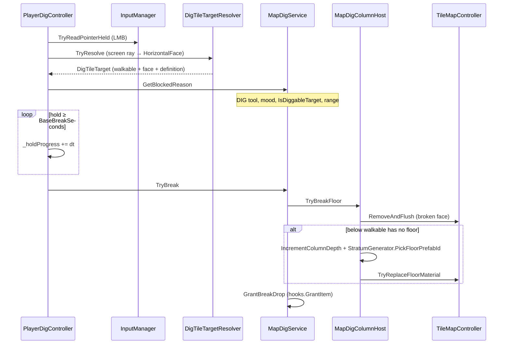

# Map Dig — 채굴·굴착 SSOT

> LLM/에이전트용 Dist 맵 굴착 SSOT. 스크립트 수정 전 이 문서를 읽는다.
> 진입: [`docs/map/SYSTEM.md`](SYSTEM.md) · 경로: `Assets/Dist/Scripts/Map/Dig/`

## 개요

플레이어가 **DIG 품질** 도구를 들고 LMB를 홀드하면, 조준 레이가 가리키는 **HorizontalFace**(walkable 셀 바로 아래 바닥면)를 파괴한다. 상층 바닥 face를 제거하고, 아래 walkable에 바닥이 없으면 `stratumSeed` 기반 결정론적 지층 바닥을 생성한다.

경작(till)과 **별개 동작**이다. 같은 `DIGGABLE` 바닥재라도 입력·파이프라인·지형 결과가 다르다 — § Till vs dig-break.

## 타일 플래그 (`TileFlags`)

`Assets/Dist/Scripts/Map/TileMap/TileFlags.cs` — BN-style string flag SSOT.

| 플래그 | 의미 | 소비자 |
|--------|------|--------|
| `MINEABLE` | 채굴 대상 (암석·광석류) | `TileFlags.IsDiggableTarget` → `MapDigService` / `DigTileTargetResolver` |
| `DIGGABLE` | 굴착 대상 (흙·잔디 등) | 동일 + 농사 `MapPlantHost.IsTillable` (경작 가능) |
| `PLOWABLE` | 경작 전용 (쟁기 대상) | `MapPlantHost.IsTillable`만 — dig-break 게이트 **아님** |

```csharp
// 채굴·굴착 break 게이트 (MINEABLE ∪ DIGGABLE)
TileFlags.IsDiggableTarget(definition)
```

한 `TileDefinition`에 여러 플래그가 공존할 수 있다. `DIGGABLE`만 겹치는 바닥은 **경작**과 **dig-break** 둘 다 가능하나, 플레이어가 선택한 액션(농사 타겟 vs LMB 홀드)에 따라 다른 서비스가 실행된다.

## BN bake 경로

1. **BN 소스** — `data/json/furniture_and_terrain` terrain 항목의 farming flags.
2. **Converter** — `Tools/bn_converter/convert.py` `FARMING_FLAGS` 화이트리스트에 `DIGGABLE` / `MINEABLE` 포함 → `StreamingAssets/BNData/terrain_furniture.json`.
3. **런타임 POCO** — `Garunnir.Runtime.Gameplay.Data.TerrainData` (farming flags).
4. **TileDefinition 동기화** — 에디터 `Tools/Map/Sync TileDefinition flags from BN` (`TileDefinitionBnFlagsSyncEditor`): BN terrain의 `MINEABLE`/`DIGGABLE` → `SOData/Tile/...` `TileDefinition.flags`.

필드 화이트리스트·rebake 이력: [`docs/equipment/BN_BAKE.md`](../equipment/BN_BAKE.md) (2026-09-05 MINEABLE/DIGGABLE 승격).

**순서:** BN rebake → TileDefinition flag sync → Play. Converter만 돌리고 TileDefinition을 sync하지 않으면 break/till 게이트가 BN과 어긋난다.

## 런타임 구성요소

| 타입 | 역할 |
|------|------|
| `MapDigColumnHost` | `TileMapManager` 동일 GO. column depth·`stratumSeed`·`TryBreakFloor` (face 제거 + 지층 생성) |
| `MapDigService` | `CanBreak` / `TryBreak` / `TryBreakAt` — 도구·무드·사거리·플래그 게이트 |
| `MapDigRuntimeHooks` | Dist.Map ↔ DistScript 브리지 (`MapGameplayBootstrap.BindMapDigService`) |
| `DigTileTargetResolver` | 카메라 레이 → `FloorFacePicker` → `DigTileTarget` |
| `PlayerDigController` | possessed 플레이어 LMB 홀드·진행·하이라이트 |
| `StratumProfile` (SO) | 깊이별 prefabId 레이어 목록 (`TileMapManager` Inspector) |
| `StratumGenerator` | `MixSeed(stratumSeed, x, z, depth)` 결정론적 선택 |
| `MapDigConsts` | `BaseBreakSeconds`(2.5s), `DigActionRangeCells`(1), 드롭 매핑 |

### `stratumSeed`

- DTO: `MapSaveJsonDto.stratumSeed` (`MapSaveSchema.StratumSeedV3`, schemaVersion 3).
- 로드: `MapDigColumnHost.LoadFromDto` — `0`이면 `Random.Range(1, int.MaxValue)`로 맵당 시드 부여.
- 저장: `WriteToDto` + `MapSaveLayerCarryOver` carry-over.
- 용도: 같은 `(x, z, depth)`에서 항상 같은 지층 prefabId (`StratumProfile.layers` 순환). **column depth**는 `(x,z)`별 dig-break 횟수 (`MapDigColumnHost._columnDepthByXz`) — 현재 DTO에 직렬화되지 않음; 세션 내 런타임만.

### 상수 (`MapDigConsts`)

| 상수 | 값 | 의미 |
|------|-----|------|
| `BaseBreakSeconds` | 2.5 | 홀드 완료까지 필요 시간 |
| `DigActionRangeCells` | 1 | 액터 점유 셀 기준 XZ Chebyshev (동일 Y) |
| `MaxRayDistance` | 200 | 타겟 레이 최대 거리 |
| `DefaultStratumFloorPrefabId` | `Floor/Floor` | `StratumProfile` 비었을 때 폴백 |

드롭: `TryGetDropItemId(prefabId)` — 예) `Floor/GrassFloor`→`dirt`, `Floor/Floor`→`rock`. 매핑 없으면 break는 성공해도 아이템 없음.

## 플레이어 dig-break 흐름



**바인딩**

- `TileMapManager.SetupMapDig()` — `MapDigColumnHost.BindMapContext` + DTO 로드.
- `MapGameplayBootstrap.BindMapDigService()` — `PlayerHasDigTool` = 인벤·왼손 `MapPlantService.HasDigQuality` (DIG 품질), `TryResolveActorCell` = `MapPlantService.TryResolveActorCell`, `GrantItem` = 월드 드롭.
- `PlayerController` — `PlayerDigController` SerializeField 또는 `AddComponent`.

**입력 억제** (`PlayerDigController.ShouldSuppressDig`): 조준 중, Farm/Construction/Fish 타겟 세션, 건설 UI, UI 메뉴 입력, GraphicRaycaster UI hit.

**프레젠테이션**: 홀드 중 `TilePresentationSystem.SetDigHighlight(presentationTileId)`.

## Till vs dig-break

| | **Till (경작)** | **Dig-break (채굴·굴착)** |
|--|-----------------|---------------------------|
| 진입 | 인벤/타일 컨텍스트 → `FarmCellTargetFlow` · `TillContextAction` | LMB 홀드 (`PlayerDigController`) |
| 서비스 | `MapPlantService.TryTill` → `MapPlantHost.TryTill` | `MapDigService.TryBreak` → `MapDigColumnHost.TryBreakFloor` |
| 바닥 조건 | `IsTillable`: `PLOWABLE` **또는** `DIGGABLE`, 미경작 | `IsDiggableTarget`: `MINEABLE` **또는** `DIGGABLE` |
| 지형 결과 | 바닥 **재질 교체** → `Floor/Tilled` (`TryReplaceFloorMaterial`) | HorizontalFace **제거**; 필요 시 아래층 **지층 생성** |
| face 타일 | 가구/점유 유지 | `RemoveAndFlush`로 face 타일 삭제 |
| 도구 | DIG 품질 (`HasDigQuality`) | 동일 |
| 타이밍 | Farm Work 게이지 (`TillWorkDurationSeconds`) | `BaseBreakSeconds` 홀드 |
| 사거리 | Farm 파이프라인 (`MapPlantConsts` / arrive) | `DigActionRangeCells` Chebyshev 1 |
| 연관 문서 | [`docs/farming/FARMING.md`](../farming/FARMING.md) | 이 문서 |

**요약:** till은 같은 walkable 셀 바닥을 `Tilled`로 **덮어쓰기**만 한다. dig-break는 셀 **아래 face를 깎고** 수직으로 한 단 deeper 노출·생성한다. `PLOWABLE`-only 바닥은 경작만, `MINEABLE`-only는 dig-break만.

## 저장·로드

| 필드 | SSOT | 비고 |
|------|------|------|
| `stratumSeed` | `MapSaveJsonDto` | 맵당 지층 RNG 시드 |
| tiles / floorFaces | 기존 TileMap save | break로 변경된 face·바닥은 일반 타일 저장 |
| column depth | (미저장) | 재로드 시 depth 카운터 0 — 동일 셀 재파괴 시 지층 선택이 세션과 달라질 수 있음 |

`MapFileSaver` / `MapSavePipeline` / `MapSaveLayerCarryOver`가 `MapDigColumnHost`에 `WriteToDto` / carry-over 위임.

## Phase C — Pit floor visibility (Pending)

**상태: 미구현 (Phase C).**

굴착으로 생긴 **pit**(상층 face 제거 + 아래 walkable 노출)에서, 플레이어가 pit 가장자리·다른 층에 있을 때 **아래층 바닥·벽의 structural hide/show**가 dig 컨텍스트와 맞게 동기화되지 않는다. 현재 층 가시성 SSOT는 [`TILEMAP_VISIBILITY.md`](TILEMAP_VISIBILITY.md)의 `PlayerFloorVisibilityPolicy` + `FloorVisibilitySyncPlanner` (`TileViewPresentationApplier`)이며, dig-break 후 pit universe를 ctx diff에 **명시적으로 넣는 경로는 없다**.

**Phase C 목표 (Pending):**

- pit column / exposed lower floor 변경 시 `FloorVisibilitySyncPlanner` sync 후보에 pit 인접 타일 포함 (또는 dig 전용 visibility hook).
- pit 가장자리에서 아래층 floor가 outdoor structural hide 규칙과 충돌하지 않도록 reconcile.
- 청크 재진입 시에도 동일 (`SyncPresentationForTile` 1타일 reconcile).

구현 전까지: dig-break 기능·저장·지층 생성은 Phase A–B 범위에서 동작; pit 특화 가시성은 기존 층 정책에 의존.

## 관련 파일

| Concern | Path |
|---------|------|
| 서비스·호스트 | `Map/Dig/MapDigService.cs`, `MapDigColumnHost.cs`, `MapDigConsts.cs`, `MapDigRuntimeHooks.cs` |
| 타겟·지층 | `DigTileTarget.cs`, `DigTileTargetResolver.cs`, `StratumGenerator.cs`, `StratumProfile.cs` |
| 플레이어 | `Entity/Player/PlayerDigController.cs`, `PlayerController.cs` |
| 플래그 | `TileMap/TileFlags.cs` |
| 브리지 | `Gameplay/MapPresentation/MapGameplayBootstrap.cs` |
| BN sync | `Editor/Map/TileDefinitionBnFlagsSyncEditor.cs` |
| 가시성 (Phase C) | `TileMap/TileVisibility/FloorVisibilitySyncPlanner.cs`, `TILEMAP_VISIBILITY.md` |
