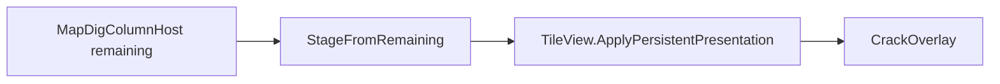
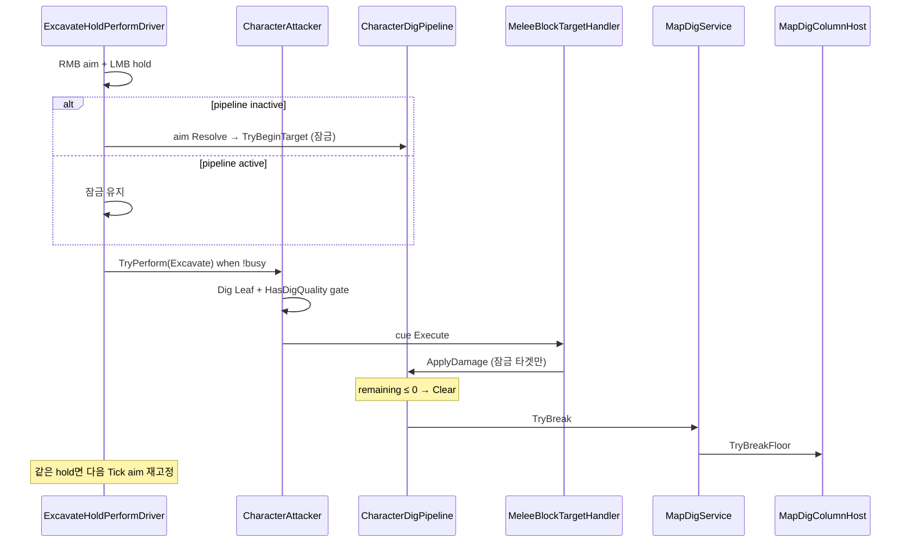

# Map Dig — 채굴·굴착 SSOT

> LLM/에이전트용 Dist 맵 굴착 SSOT. 스크립트 수정 전 이 문서를 읽는다.
> 진입: [`docs/map/SYSTEM.md`](SYSTEM.md) · 경로: `Assets/Dist/Scripts/Map/Dig/`  
> 전투 파이프라인(Leaf·hold·handler): [`../equipment/COMBAT_PIPELINE.md`](../equipment/COMBAT_PIPELINE.md)

## 개요

**Dig = 무기 Leaf 결과** (`CombatLeaf.Excavate`). … 상층 바닥 face를 제거하고, 아래 walkable에 지지가 없으면 `stratumSeed` 기반 결정론적 **walkable stratum 블록**(`OccupiedCell`, `providesLogicalFloor`, 앵커 = walkable + down — ThickWall과 동일)을 생성한다.

**타일 내구도**는 맵 SSOT(`MapDigColumnHost` remaining HP · `MapSaveJsonDto`)다. Dig·벽 HP·벌목은 동일 채널×재질 소비.

**손상 비주얼 · 표현 축(저장 유무):**

| 축 | 저장 | 예 | 뷰 진입 |
|----|------|----|---------|
| **Persistent** | Host HP (`tileDurabilities`)에서 파생. stage 자체는 비저장 | 크랙 `DamageStage` | `ApplyPersistentPresentation` / `ApplyDamageStage` · 스폰 `SyncDamageStageFromHost` |
| **Transient** | 비저장 | Dig VividEmphasis, Selected, 카메라/층 Structural·Ghost·Occlusion·SightLine | `ApplyTransientPresentation` / `ApplyResolved` · Dig는 `SetVividEmphasis`만 |

계약: **Transient 경로가 Persistent를 덮지 않는다.** Dig 타겟에 `TileViewCrackOverlay`(destroy_stage식 큐브).

**지층 큐브 비주얼:** `Terrain/DirtBlock`·`Terrain/StoneBlock` = Occupied 큐브 + `TileCubeFaceAtlas`(**6슬롯 SSOT**, **에디터 bake** 아틀라스·머티리얼) + `TileCubeVisual`(메쉬 1·드로우 1). bake 머티리얼 템플릿은 Atlas의 `Source Material`. 런타임 텍스처 패킹/Blit 없음. West만 다르게 = West 슬롯만 교체 후 bake. Floor 슬랩과 병행.

경작(till)과 **별개 동작**이다. 같은 `DIGGABLE` 바닥재라도 입력·파이프라인·지형 결과가 다르다 — § Till vs dig-break.

## 타일 플래그 (`TileFlags`)

`Assets/Dist/Scripts/Map/TileMap/TileFlags.cs` — BN-style string flag SSOT.

| 플래그 | 의미 | 소비자 |
|--------|------|--------|
| `MINEABLE` | 채굴 대상 (암석·광석류) | `TileFlags.IsDiggableTarget` → `MapDigService` / `DigTileTargetResolver` |
| `DIGGABLE` | 굴착 대상 (흙·잔디 등) | 동일 + 농사 `MapPlantHost.IsTillable` (경작 가능) |
| `PLOWABLE` | 경작 전용 (쟁기 대상) | `MapPlantHost.IsTillable`만 — dig-break 게이트 **아님** |

```csharp
// 채굴·굴착 break 게이트 (MINEABLE ∪ DIGGABLE)
TileFlags.IsDiggableTarget(definition)
```

한 `TileDefinition`에 여러 플래그가 공존할 수 있다. `DIGGABLE`만 겹치는 바닥은 **경작**과 **dig-break** 둘 다 가능하나, 플레이어가 선택한 액션(농사 타겟 vs RMB+LMB 홀드 Excavate)에 따라 다른 서비스가 실행된다.

## BN bake 경로

1. **BN 소스** — `data/json/furniture_and_terrain` terrain 항목의 farming flags.
2. **Converter** — `Tools/bn_converter/convert.py` `FARMING_FLAGS` 화이트리스트에 `DIGGABLE` / `MINEABLE` 포함 → `StreamingAssets/BNData/terrain_furniture.json`.
3. **런타임 POCO** — `Garunnir.Runtime.Gameplay.Data.TerrainData` (farming flags).
4. **TileDefinition 동기화** — 에디터 `Tools/Map/Sync TileDefinition flags from BN` (`TileDefinitionBnFlagsSyncEditor`): BN terrain의 `MINEABLE`/`DIGGABLE` → `SOData/Tile/...` `TileDefinition.flags`.

필드 화이트리스트·rebake 이력: [`docs/equipment/BN_BAKE.md`](../equipment/BN_BAKE.md) (2026-09-05 MINEABLE/DIGGABLE 승격).

**순서:** BN rebake → TileDefinition flag sync → Play. Converter만 돌리고 TileDefinition을 sync하지 않으면 break/till 게이트가 BN과 어긋난다.

## 런타임 구성요소

| 타입 | 역할 |
|------|------|
| `MapDigColumnHost` | `TileMapManager` 동일 GO. column depth·`stratumSeed`·`TryBreakFloor` (face 제거 + 지층 생성) |
| `MapDigService` | `CanBreak` / `TryBreak` / `TryBreakAt` — 도구·무드·사거리·플래그 게이트 |
| `MapDigRuntimeHooks` | Dist.Map ↔ DistScript 브리지. 사거리: `TryResolveActorWorld`(발끝 transform). `GridPos`/`TryResolveActorCell`(농사·낚시)와 분리 |
| `MeleeBlockTargetHandler` | `melee_block_target` — impact cue는 **DigPipeline 잠금** 타겟만 `ApplyDamage` (`IsActive` 필수; live Aim 재 Resolve 없음) |
| `DigTileTargetResolver` | `TryResolveFromCombatAim` — AimWorldPoint → **셀·큐브 바깥면 중심** 근접 diggable (HorizontalFace / walkable stratum Occupied) + 발끝→walkable 셀 중심 월드 유클리드 clamp (`DigActionRangeCells` × cellSize); **잠금 begin·비홀드 preview** 공용 |
| `CharacterDigPipeline` | plain class (`CharacterActionHost` 소유). LMB 홀드 **잠금**·맵 remaining HP·`TryBreak` (하이라이트는 Preview) |
| `ExcavateHoldPerformDriver` | `MeleeStructureHoldPerformDriver` — LMB down/재획득 aim→잠금, hold 유지, release Clear; 파괴 후 같은 hold면 aim 재고정 |
| `MeleeBlockAimPreview` | 잠금 타겟 우선 highlight, 없으면 aim + `CanBreak` → `SetDigHighlight` |
| `DigTileTargetAimPose` | 잠금 Dig 타겟 → Sight 월드점 (face / 바깥면) |
| `CharacterSightHost` | 본체 Sight 구독 게이트 — Free=마우스 sample 수락, StructureLock=무시·블록 포즈. 플레이어 조회=`PlayerPossessSession.SessionSightHost` |
| `PlayerCombatController` | Layer2 host — `ICombatPerformDriver` + `ICombatTargetingPreview` 라우트·틱 |
| `StratumProfile` (SO) | 깊이별 prefabId 레이어 목록 (`TileMapManager` Inspector) |
| `StratumGenerator` | `MixSeed(stratumSeed, x, z, depth)` 결정론적 선택 |
| `TileDefinition` | `materials`·`breakDurability`·`materialThickness` — 타일 재질·내구도 SSOT |
| `MapDigConsts` | `DefaultDigDurability`(breakDurability 0 폴백)·`BaseBreakSeconds`·사거리·드롭 |

### `stratumSeed`

- DTO: `MapSaveJsonDto.stratumSeed` (`MapSaveSchema.StratumSeedV3`, schemaVersion 3).
- 로드: `MapDigColumnHost.LoadFromDto` — `0`이면 `Random.Range(1, int.MaxValue)`로 맵당 시드 부여.
- 저장: `WriteToDto` + `MapSaveLayerCarryOver` carry-over.
- 용도: 같은 `(x, z, depth)`에서 항상 같은 지층 prefabId (`StratumProfile.layers` 순환). **column depth**는 `(x,z)`별 dig-break 횟수 — `MapSaveJsonDto.columnDepths`에 직렬화(schema ≥ `TileDurabilityV4`).

### 상수·재질 (`TileDefinition` · `CombatMath` · `MapDigConsts`)

| 필드/상수 | 값/의미 | 비고 |
|-----------|---------|------|
| `TileDefinition.breakDurability` | 파괴 HP | 0 → `DefaultDigDurability`(250). DirtBlock 250 · StoneBlock 400 |
| `TileDefinition.materials` | BN `MaterialData` id | bash/cut resist — Wear와 동일 |
| `TileDefinition.materialThickness` | 재질 두께 | `WearCombatDefense.ArmorRating` 스케일 |
| Excavate 피해 | `CombatMath.ResolveExcavateDamage` | 채널별 `DamageForTag` + DIG potency → `MitigateStructureDamage` (피해 곡선 유지 않음; 내구로 cue 수 맞춤) |
| `DefaultDigDurability` | 250 | breakDurability 미지정 폴백 · `DigBreakCuesAtDigLevel1`(5) × ~cue 50 |
| `DigBreakCuesAtDigLevel1` | 5 | level-1 삽 dig-break cue 횟수 패리티 |
| `BaseBreakSeconds` | 2.5 | 벽시계 패리티 대략치 |
| `DigActionRangeCells` | 2 | 설계 상수. 월드 반경 = `DigActionRangeCells × cellSize`. actor **발끝 transform** → 목표 walkable 셀 중심 3D 유클리드 (`MapDigConsts.IsWithinActionRangeWorld`). `GridPos`와 분리. 초과 조준은 액터→ideal 3축 스텝 clamp |
| `MaxRayDistance` | 200 | 타겟 레이 최대 거리 |
| `DefaultStratumBlockPrefabId` | `Terrain/StoneBlock` | `StratumProfile` 비었을 때 폴백 |
| `DefaultStratumFloorPrefabId` | `Terrain/StoneBlock` | 레거시 alias |

드롭: `TryGetDropItemId(prefabId)` — 예) `Floor/GrassFloor`→`dirt`, `Floor/Floor`→`rock`. 매핑 없으면 break는 성공해도 아이템 없음.

### 내구도 모델

| | SSOT |
|--|------|
| HP 저장 | `MapDigColumnHost` (walkable 셀 키) · `MapSaveJsonDto.tileDurabilities` |
| 피해량 | 채널 × TileDefinition 재질 per Excavate / 벽 / 벌목 cue |
| Dig Leaf 없는 무기 | `CanPerform(Excavate)` false |
| 크랙 stage | `StageFromRemaining` — 저장 HP 파생(stage 값 자체는 비저장) |
| 크랙 적용 | Persistent: `ApplyHpToView` → `ApplyPersistentPresentation`. Transient(`ApplyResolved`/`SetVividEmphasis`)는 미개입. 스폰만 `SyncDamageStageFromHost` |
| 지층 큐브 | `TileCubeFaceAtlas` 6슬롯(U/D/N/S/E/W) + `TileCubeVisual` · prefab `MapTiles/Terrain/*` |



## 플레이어 dig-break 흐름



**바인딩**

- **입력:** `PlayerPossessedInputHost` → `PlayerCombatController` (Layer2 drivers). dig 전용 MB **없음**.
- **조준:** Layer1 — 입력(`PlayerAimController`)은 `IAimSightProvider` **sample만 제안**. 본체 `CharacterSightHost`가 Free면 수락(`SightDir`), Dig LMB 잠금(`StructureLock`)이면 sample 무시·블록 포즈 유지(`DigTileTargetAimPose`). Flatten Y = `CombatAimSightPolicy`. **카메라 자유**. Resolve → Preview(잠금 우선 highlight).
- **행동:** LMB **down/재획득** = aim → `DigPipeline` 잠금 → `SightHost.EnterStructureLock`. **hold** = 잠금 유지 + `TryPerform(Excavate)`. **release**/Clear = `ExitStructureLock` → 마우스 sample 구독 복귀. **파괴 후 같은 hold** = aim 재고정 + 다시 StructureLock. cue는 잠금 타겟만.
- **손 게이트:** 일반 combat **ActiveWieldHand** 스택 — Dig 전용 손 스캔 아님. `HasDigQuality`(DIG level ≥1)면 Dig Leaf 가능.
- **애니:** `AttackResolved` → 기존 Attack overlay 큐 (`CombatLeaf.Excavate` Leaf / Catalog). Farm Work Layer·presentation-only 큐 **아님**. AnimatorController에 Dig 상태 이름 **미추가**.
- `TileMapManager.SetupMapDig()` — `MapDigColumnHost.BindMapContext` + DTO 로드.
- `MapGameplayBootstrap.BindMapDigService()` — `PlayerHasDigTool` = ActiveWield 스택 DIG 품질.

## Till vs dig-break

| | **Till (경작)** | **Dig-break (채굴·굴착)** |
|--|-----------------|---------------------------|
| 진입 | 인벤/타일 컨텍스트 → `FarmCellTargetFlow` · `TillContextAction` | RMB 조준 + LMB 홀드 (`ExcavateHoldPerformDriver` → `CombatLeaf.Excavate`) |
| 서비스 | `MapPlantService.TryTill` → `MapPlantHost.TryTill` | `MapDigService.TryBreak` → `MapDigColumnHost.TryBreakFloor` |
| 바닥 조건 | `IsTillable`: `PLOWABLE` **또는** `DIGGABLE`, 미경작 | `IsDiggableTarget`: `MINEABLE` **또는** `DIGGABLE` |
| 지형 결과 | 바닥 **재질 교체** → `Floor/Tilled` (`TryReplaceFloorMaterial`) | HorizontalFace **제거** 또는 walkable stratum **블록 제거**; 필요 시 아래층 **지층 블록 생성** (`TryPlaceStratumBlock`) |
| face 타일 | 가구/점유 유지 | `RemoveAndFlush`로 face 타일 삭제 |
| 도구 | DIG 품질 (`HasDigQuality`) | 동일 + ActiveWield Dig Leaf |
| 타이밍 | Farm Work 게이지 (`TillWorkDurationSeconds`) | Dig cue × session proxy (`DefaultDigDurability` / DIG level) |
| 애니 | Farm **Work Layer** (`FarmWorkClipCatalog`) | Dig Leaf → **Attack overlay** (Melee Family) |
| 사거리 | Farm 파이프라인 (`MapPlantConsts` / arrive) | 발끝 transform→walkable 셀 중심 월드 유클리드 `DigActionRangeCells × cellSize` (+ combat clamp) |
| 연관 문서 | [`docs/farming/FARMING.md`](../farming/FARMING.md) | 이 문서 · [`GEAR.md`](../equipment/GEAR.md) Dig Leaf |

**요약:** till은 같은 walkable 셀 바닥을 `Tilled`로 **덮어쓰기**만 한다. dig-break는 셀 **아래 face를 깎고** 수직으로 한 단 deeper 노출·생성한다. `PLOWABLE`-only 바닥은 경작만, `MINEABLE`-only는 dig-break만.

## 저장·로드

| 필드 | SSOT | 비고 |
|------|------|------|
| `stratumSeed` | `MapSaveJsonDto` | 맵당 지층 RNG 시드 |
| tiles / floorFaces | 기존 TileMap save | break로 변경된 face·바닥은 일반 타일 저장 |
| column depth | `MapSaveJsonDto.columnDepths` | `(x,z)` dig-break 횟수 |
| 타일 내구도 | `MapSaveJsonDto.tileDurabilities` | walkable 셀 remaining HP (풀 HP는 생략) |

`MapFileSaver` / `MapSavePipeline` / `MapSaveLayerCarryOver`가 `MapDigColumnHost`에 `WriteToDto` / carry-over 위임.

## Pit floor visibility

굴착으로 생긴 **pit**은 `MapDigColumnHost.TryBreakFloor` 직후 `TileViewPresentationApplier.ResetFloorVisibilityState()`로 lastCtx를 무효화한다. 다음 `SyncFloorVisibility`가 peek(`VisibleBelowCells`) 후보를 풀 리빌드해 아래층 floor·벽을 맞춘다. 층 가시성 SSOT: [`TILEMAP_VISIBILITY.md`](TILEMAP_VISIBILITY.md).

## 검증

| 항목 | 기대 |
|------|------|
| RMB 없이 LMB | Excavate/Strike/Trigger 불가 |
| RMB + LMB click | Swing/Trigger `TryPerformSelected` |
| DIG + Excavate + RMB (유클리드 ≤2 diggable) | face 블록 **VividEmphasis** Add 강조 (`SetDigHighlight` → `SetVividEmphasis` → `_EmphasisAdd`, select 외곽선 아님) |
| 반경 밖 조준 | 액터→ideal 3축 스텝 clamp 사거리 끝 face 하이라이트 |
| DIG 도구 없음 / `CanBreak` false | 하이라이트 없음 |
| RMB + LMB hold (Excavate) | Dig 잠금 + `SightHost.StructureLock` — 마우스 sample 미구독, SightDir=블록, 카메라 자유 |
| 잠금 타겟 파괴 후 hold 유지 | aim 재고정 → 다시 StructureLock |
| LMB up, RMB 유지 | Clear → `ExitStructureLock` · 마우스 sample 구독 복귀 |
| DIG 없는 무기 | `CanPerform(Excavate)` false |
| DIG + Excavate + RMB hold 피해 | Dig 타겟 **큐브/슬랩 외곽**에 크랙 stage 증가 (풀 HP면 없음) |
| Terrain Dirt/Stone | 6면 슬롯 아틀라스(예: West만 다른 색), Occupied stratum dig 가능 |
| 손상 타일 청크 재스폰 | 크랙 stage 복원 (HP 파생) |
| Error 0 | Unity Console |

## 관련 파일

| Concern | Path |
|---------|------|
| 서비스·호스트 | `Map/Dig/MapDigService.cs`, `MapDigColumnHost.cs`, `MapDigConsts.cs`, `MapDigRuntimeHooks.cs` |
| 핸들러 | `Entity/Combat/MeleeBlockTargetHandler.cs` (`melee_block_target`) |
| 타겟·지층 | `DigTileTarget.cs`, `DigTileTargetResolver.cs`, `StratumGenerator.cs`, `StratumProfile.cs` |
| Preview | `Entity/Player/Combat/Targeting/ICombatTargetingPreview.cs`, `MeleeBlockAimPreview.cs` |
| 플레이어·파이프라인 | `PlayerCombatController`, `MeleeStructureHoldPerformDriver` / Dig·Chop 파생, `CharacterStructureTargetPipeline`, `IAimSightProvider` |
| DIG potency | `MapPlantService.ResolveDigQualityLevel` / `HasDigQuality` |
| 타일 combat | `Map/TileMap/TileDefinition.cs`, `TileDefinitionCombat.cs` |
| 크랙 presentation | `TileDamagePresentation*.cs`, `TileViewCrackOverlay.cs`, `TileView.SetDamageStage` |
| 지층 큐브 visual | `TileMap/Cube/TileCubeFaceAtlas.cs`, `TileCubeMeshBuilder.cs`, `TileCubeVisual.cs` |
| 피해 SSOT | `CombatMath.ResolveExcavateDamage`, `WearCombatDefense.MitigateStructureDamage` |
| 플래그 | `TileMap/TileFlags.cs` |
| 브리지 | `Gameplay/MapPresentation/MapGameplayBootstrap.cs` |
| BN sync | `Editor/Map/TileDefinitionBnFlagsSyncEditor.cs` |
| Catalog Ensure | `Editor/Anim/WeaponDigLeafEnsurer.cs` (`Dist/MCP/Ensure Dig Leaf Entries` · `Ensure Chop Leaf Entries`) |
| 가시성 (pit) | `TileViewPresentationApplier.ResetFloorVisibilityState` after dig-break · `TILEMAP_VISIBILITY.md` |
