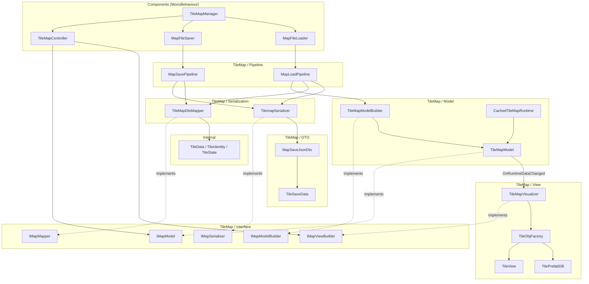
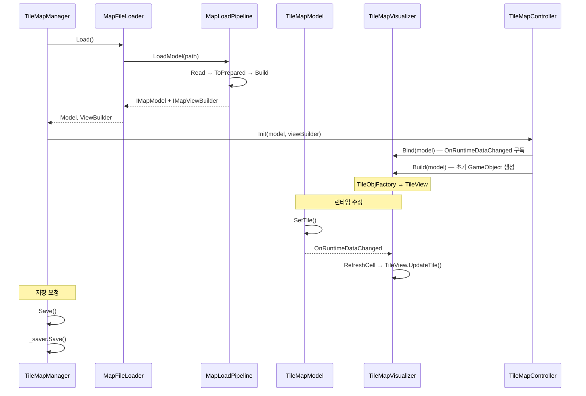

# Map System — 전체 개요

> LLM/에이전트용 Dist 맵 SSOT 진입점.
> 인덱스: `docs/README.md` · 룰: `.cursor/rules/map-system.mdc`
> **맵·타일맵 스크립트를 쓰거나 고치기 전에 이 문서와 아래 세부를 읽는다.**

패턴: MVC + Pipeline + Observer  
세부 문서: [COMPONENTS.md](COMPONENTS.md) | [DATA.md](DATA.md) | [TILEMAP.md](TILEMAP.md)  
경로(코드): `Assets/Dist/Scripts/Map/`

---

## 의존성 다이어그램



**청크 스트리밍 desired** = `CameraGroundView` 지면 footprint + `CameraChunkMargin` (`TileMapChunkStreamer`). 지면 AABB 수학은 `CameraGroundView`, 청크 변환만 `TileViewportBounds`.

### 맵 혈흔

경로: `Assets/Dist/Scripts/Map/Blood/`. `TileMapManager`가 `MapBloodHost`를 바인딩·DTO 로드. 세이브 시 `MapSavePipeline`이 `bloodStamps`를 JSON에 병합. 모델(스탬프)은 청크 unload와 무관하게 유지; 뷰는 인스턴스 드로우만.

혈흔 VFX 파티클 착지: 공용 `MapParticleFloorLanding` (`NotifyOnly`) + `MapBloodParticleStampWriter`가 `Landed`를 구독해 스탬프. 바닥 높이는 `FloorMapIndex.TryGetHighestWalkableFloorAtOrBelow` 컬럼 인덱스 (`MapParticleFloorLandingProbe`) — Physics Collider / `ResolveFromWorld` Y루프 아님.

### 파티클 논리 바닥 착지 (공용)

경로: `Assets/Dist/Scripts/Map/MapCollision/MapParticleFloorLanding*.cs`.

수직 교차 판정 SSOT: `MapLogicalFloorCross` (캐릭터 `MapLogicalFloorProbe`와 동일 — curr/pred 1스텝). 투사체 `MapTopologyLineCast`와 별개.

| 모드 | 소비자 | 동작 |
|------|--------|------|
| `KillOnLand` | `Vfx_Rain` | Y 스냅 → Manual `TriggerSubEmitter` → kill (`SetParticles`는 Death를 안 탐) |
| `NotifyOnly` | `Vfx_HitBleed*` | 파티클 유지, `OnLanded`만 (스탬프 등) |

### 맵 식물

경로: `Assets/Dist/Scripts/Map/Plant/`. `TileMapManager`가 `MapPlantHost`를 바인딩·구 `plantCells` 마이그레이션. Plant는 OccupiedCell `tiles` (+ floor `Floor/Tilled`). 뷰는 청크 TileView (`Furniture/Plant_*`). 설치: `TilePlaceUtil` (건설과 공유). 계약: [`docs/farming/FARMING.md`](../farming/FARMING.md).

### 맵 액체

경로: `Assets/Dist/Scripts/Map/Liquid/`. `TileMapManager`가 `MapLiquidHost`를 바인딩·DTO `liquidCells` 로드. 모델(스파스 ml 오버레이)은 청크 unload와 무관하게 유지; 수면 뷰는 `MapLiquidSurfaceRenderer`가 **로드된 청크 + 변경 셀**만 메시화. Flow는 `WorldClock.MinuteChanged` + dirty 큐(정지 바다 비용 0). 계약: [`docs/map/LIQUID.md`](LIQUID.md).

### 맵 굴착 (dig-break)

경로: `Assets/Dist/Scripts/Map/Dig/`. `TileMapManager`가 `MapDigColumnHost`를 바인딩·DTO `stratumSeed`/`columnDepths`/`tileDurabilities` 로드. Dig = Layer2 `ExcavateHoldPerformDriver` (RMB 조준 + LMB hold → `AimWorldPoint`) → Excavate cue → 채널×`TileDefinition.materials` 피해 → 맵 remaining HP → `MapDigService` face 제거·지층 생성. BN `MINEABLE`/`DIGGABLE` → TileDefinition flags. 경작(till)과 별도 — [`docs/farming/FARMING.md`](../farming/FARMING.md). 계약: [`docs/map/DIG.md`](DIG.md). Pit 가시성 = dig-break 후 floor visibility lastCtx 무효화.

---

## 데이터 흐름 요약



---

## 레이어별 역할

| 레이어 | 위치 | 역할 |
|--------|------|------|
| Coordinator | `Components/` | `TileMapManager` — 생명주기 조율, wiring |
| Entry | `Components/` | `MapFileLoader`, `MapFileSaver`, `TileMapController` |
| Data | `Internal/` | 순수 구조체 (Unity 비의존) |
| Interface | `TileMap/Interface/` | 레이어 간 계약, 결합도 최소화 |
| DTO | `TileMap/DTO/` | JSON 직렬화 전용 포맷 (`hasPlayerProgressSnapshot` / `playerProgressJson`) |
| Model | `TileMap/` | 런타임 상태, BFS 오클루전 |
| View | `TileMap/` | GameObject 생성·갱신 |
| Pipeline | `TileMap/` | 단계 조합 (교체 가능) |

### 플레이어 진행 (`playerProgressJson`)

Possessed 플레이어 스냅샷. `CharacterDefinition` 시드 후 `PlayerProgressSaveBridge.TryRestorePossessed`가 덮어씀.

| 포함 | DTO |
|------|-----|
| 위치·방향 | `PlayerProgressSaveDto` |
| 몸·체온 | `CharacterBodyDto`, `BodyTempSaveDto` |
| 스킬·바이탈·숙련·레시피·trait | `CharacterProgressSaveDto` 계열 |
| 인벤·장비 | `inventoryJson` → `InventoryGearSaveDto` (몸통·착용·들기) |

저장: `MapSaveLayerCarryOver.MergePlayerProgress` · 로드: `PlayerProgressSnapshotPending` → possess 후 복원.

### 게임 슬롯 저장 (10)

| 항목 | SSOT |
|------|------|
| API | `GameSaveSlotService` (`Assets/Dist/Scripts/Gameplay/Save/`) |
| 경로 SSOT | `GameSaveSlotPaths` (`Assets/Dist/Scripts/Map/TileMap/DTO/`) |
| 맵 파일 | `{persistentDataPath}/saves/slot_{00..09}.json` |
| 메타 | `{persistentDataPath}/saves/slot_{00..09}.meta.json` (`GameSaveSlotPaths`) |
| 로드 v1 | `GameSaveSlotSession` pending → active scene reload → `MapFileLoader`가 슬롯 경로 우선 |
| 에디터 기본 맵 | `map01.json` (슬롯과 분리) |

UI: [`../ui/SETTINGS.md`](../ui/SETTINGS.md) Game 카테고리 · `UIGameSaveSlotPopup`.

---

## 맵 저장 V5 — outdoor / buildings

bake·가시성 SSOT: [TILEMAP_BUILDING_BAKE.md](TILEMAP_BUILDING_BAKE.md) · [TILEMAP_VISIBILITY.md](TILEMAP_VISIBILITY.md).

| 구역 | 좌표 | 내용 |
|------|------|------|
| **outdoor** (`outdoorFloorFaces` / `outdoorWallEdges` / `outdoorTiles`) | **월드** | `Outdoor/` 아래 **모든** 타일. **`buildingId=-1` 불변** |
| **buildings[]** | 건물별 **로컬** (피벗 = `min xyz`) | 구조물 타일. **로드 시 buildingId 분할 보존** |

- 겹침: **구조물 우선**.
- **로컬 좌표는 save/load 직렬화만.** 런타임 모델·뷰 자식은 **월드**.
- **건물 저작** = 프리팹(인스턴스) → **타일로만 펼침**(청크). 같은 프리팹 여러 채 OK.
- **건물 프리팹 경로 SSOT:** `Assets/Dist/Visual/Prefabs/Buildings/`  
  (타일 조각은 `.../Prefabs/MapTiles/` — 건물 통째와 **섞지 않음**).
- **저장 분류** = 뷰 `Outdoor/` vs `Buildings/Building_*` **스냅샷**. **합침은 bake**(증분·Full Rebake·`Bake Building Partitions From Scene`)가 하이어라키를 맞춘 뒤. 저장은 remesh 안 함.
- **로드** = 저장된 **양수 buildingId 하드 파티션** 유지 (`AssignAll`이 Reset·재합침 안 함). **합침은 증분 편집·`RebakeAllBuildingPartitions`만.** outdoor `-1` 불변.
- **야외 bake**: outdoor 레이어만. **plaza BFS 없음.**
- **schema&lt;5 로드**: GrassFloor → outdoor 마이그레이션. **저장에 Grass 휴리스틱 없음.**
### 뷰 하이어라키

```text
TileMapView (또는 동등 루트)
├── Outdoor/          … 야외 타일 뷰
└── Buildings/
    └── Building_<id> … 피벗 표시·묶기 부모
        └── (타일 TileView — 월드 좌표)
```

- **청크 스트리밍** = 어떤 타일을 load/unload할지 **집합**만. Building GO를 청크 부모로 **쓰지 않음** (이중 부모 금지).
- Unload = **타일 단위 Despawn** (Building 통째 Destroy 아님).

---

## BN house mapgen bake

`Tools/bn_converter/export_mapgen.py` → `StreamingAssets/BNData/mapgen/houses/*.json` (`MapSaveJsonDto`).  
기본 월드 경로(`map01.json`)를 바꾸지 않는다. `MapFileLoader.fileName`으로 로드.  
가구 facing은 BN에 없음 — 날조하지 않음. nested / loot / monster는 스킵.  
Dist에 없는 가구는 BN id를 유지하고 `SOData/Tile/Furniture/BN/` TileDefinition 자리(Crate 메시 폴백)를 둔다. `Dist/MCP/BN/Ensure House Furniture Tile Definitions`.  
필드 화이트리스트: [`equipment/BN_BAKE.md`](../equipment/BN_BAKE.md).
