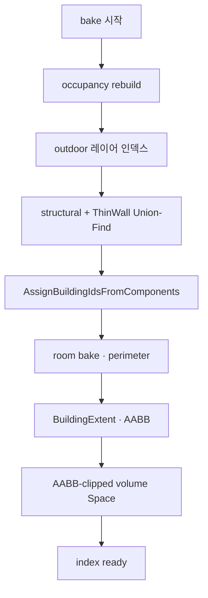

# TileMap — building·space bake 논리

맵 로드·편집 시 **buildingId · space(실내 volume) · outdoor 레이어** 의미를 bake하는 규칙만 정리한다.

**이 문서가 bake 논리의 SSOT다.** 구현·리뷰·가시성 질문은 여기를 기준으로 하고, **논리 구조를 바꾸지 않는 한 다시 합의하지 않는다.**  
구현 심볼·좌표 매핑은 [TILEMAP.md](TILEMAP.md). 가시성은 [TILEMAP_VISIBILITY.md](TILEMAP_VISIBILITY.md).  
저장 스키마·뷰 하이어라키 개요는 [SYSTEM.md](SYSTEM.md).

> **구현 반영.** outdoor = `Outdoor/` → `outdoor*` + `BuildingIdOutdoor`(**불변**, bake가 덮지 않음). 건물 **저작** = 프리팹(인스턴스) → **타일로 펼침**(청크용). **양수 `buildingId` = 하드 파티션** — `AssignAll`/로드가 Reset·재합침하지 않음. **합침은 증분 편집·`RebakeAllBuildingPartitions`(Full Rebake)만.** **minCellY plaza BFS 없음.**

---

## 대전제 (합의·재논의 금지)

1. **`collisionFlags`(논리 충돌)로 `isOutdoor` / 실내·야외 leak를 판정하지 않는다.**  
   room BFS·시선 occlusion용이지 **야외 분기·밀폐 증명**용이 아님 — [§5.1.1](#511-논리-충돌과-밀폐-추론-비대칭).
2. **야외 데이터의 SSOT = outdoor 레이어** (월드 좌표 face/타일 + 런타임 outdoor 인덱스). **minCellY floor BFS로 outdoor를 추론하지 않는다** (`RecomputeOutdoorFromMin` 삭제).
3. **`buildingId` SSOT = 연결된 구조물(component)** — structural + ThinWall 연결 그래프. walkable floor 시드 **전용** 모델이 아니다.
4. **`isOutdoor=false`는 물리 밀폐 증명이 아님** — topology상 outdoor/개방과 **미연결**일 때만 실내 **분기**.
5. **로컬 건물 좌표 = 직렬화(save/load) 전용.** 런타임 모델·`TileView`·bake 인덱스는 **월드/절대 그리드**.
6. **Space = 건물 AABB로 클립된 volume** (빈 칸 포함 가능). 야외맵 칸은 space 재분할 **대상 아님**.
7. **Outdoor `buildingId`(`-1`)는 불변** — merge·증분·전파가 절대 덮어쓰지 않음.
8. **건물 저작 단위 = 프리팹(인스턴스).** 맵/런타임/청크에는 **타일만** 펼쳐 넣음. 같은 프리팹 여러 채 OK. **양수 id는 하드 파티션(로드·AssignAll이 합치지 않음).** 합침은 증분 편집·Full Rebake만.
---

## 레이어 모델 (야외 ↔ 구조물)

| 레이어 | 좌표 | 내용 | bake 역할 |
|--------|------|------|-----------|
| **Outdoor** | 월드 | 야외 floor face 등 (잔디·도로 등) | outdoor 판정·야외 표현의 데이터 |
| **Buildings** | 저장 시 건물별 **로컬**(피벗=`min xyz`); 런타임 **월드** | 구조물 floor + wall + furniture 등 | `buildingId` · room · space |

- 같은 월드 셀에 outdoor·구조물이 **겹치면 구조물 우선**.
- **GrassFloor → outdoor 분류**는 **schema&lt;5 로드 마이그레이션만**. 저장은 하이어라키/`buildingId==-1` — Grass prefab을 outdoor SSOT로 고정하지 않음 ([SYSTEM.md](SYSTEM.md)).

---

## 왜 structural merge를 채택하는가 (ADOPTED)

> **나중에 까먹지 않도록 — 정책이 바뀐 이유.**

### 이전 폐기 사유 (기록)

한때 floor seed에서 structural끼리 multi-hop으로 id를 붙이는 **structural shell BFS / structural merge**를 썼다가, 다음 부작용으로 **폐기**했었다.

| 의도 | 당시 부작용 |
|------|-------------|
| ThickWall·EdgeWall id 누락 방지 | 먼 벽 체인까지 같은 `buildingId` |
| 구름다리 등 연결 시 merge | indoor floor hide 범위 과대 |
| structural merge pass | plaza floor가 다리가 되어 **떨어진 building 통합** |

그래서 **floor SSOT**(walkable floor 시드 → occupied-cell flood, wall–wall 단독 전파 금지)로 되돌렸다.

### 현재 결론 — **ADOPTED** (시정)

| 원칙 | |
|------|---|
| **buildingId SSOT** | **연결된 구조물** = 같은 `buildingId` (structural + ThinWall 연결) |
| **비인접 구조** | 연결되지 않으면 **새 `buildingId`** |
| **야외 다리 오통합** | outdoor 레이어·plaza floor는 building component 그래프에 **넣지 않음** (이전 plaza-bridge 버그의 발생 경로 제거) |
| **시야 이질감** | 긴 외벽·연결 구조가 한 building으로 묶여 indoor hide가 넓어질 수 있음 — **허용** |

**근거 (Zomboid류):** 월드를 outdoor / building(lot)으로 나누고, **맞닿은 구조는 한 건물·한 시야 단위**로 다루는 편이 편집·가시성·저장 단위와 맞다. Dist도 outdoor 레이어와 building component를 분리한 뒤, 구조 연결 merge를 **의도된 정책**으로 둔다.

**폐기했던 “structural merge pass” 서술과 정책이 전환되었다.** 아래 [§building 연결](#building-연결-structural--thinwall)이 새 SSOT다.

---

## 용어

| 용어 | 의미 |
|------|------|
| **outdoor 레이어** | 야외 맵 데이터 (월드). 빈 그리드 fallback과 함께 야외 분기 입력 |
| **building** | structural(+ThinWall) 연결로 묶인 구조물 component. 양수 `buildingId` |
| **ThinWall** | `VerticalFace` 등 두 점유/walkable 셀 **사이 엣지** 벽 |
| **room** | building×slice에서 room BFS로 묶인 **connected walkable floor (x,z)**. **밀폐 실내가 아님** |
| **roomId** | slice-local id. 실내/야외·밀폐와 **무관** |
| **space** | 건물 **AABB 안** 전방향 volume으로 묶인 공간 (floor·빈 칸). `SpaceId` + `isOutdoor` |
| **BuildingExtent** | `buildingId`별 footprint·AABB·`maxStructuralY` 공간 인덱스 |
| **AABB** | building 점유(및 구조)의 축정렬 바운딩 상자 — **space flood 클립**에 사용 |
| **피벗** | 저장용 `min(x,y,z)` — 로컬 오프셋 원점 (직렬화만) |
| **shell-disconnected** | 구조 연결 그래프에 안 붙은 타일 — 별도 id/0 취급 (의도) |

### buildingId 값 (고정)

| 값 | 의미 | 전파·merge |
|----|------|------------|
| **-1** | outdoor / plaza 표식 (`BuildingIdOutdoor`) — outdoor 레이어·마이그레이션 잔여 | building component **시드·흡수 대상 아님** |
| **0** | 미할당 | 수신만 |
| **&gt;0** | building | 연결 그래프의 시드·결과 |

런타임 야외 분기: `IsOutdoorEvaluation` — [TILEMAP_VISIBILITY.md §1](TILEMAP_VISIBILITY.md) (**empty/no-floor → true**, 선택 A).

---

## building 연결 (structural + ThinWall)

**한 component = 하나의 `buildingId`.**

### Structural 연결

`IsStructural` 타일(HorizontalFace·VerticalFace·ThickWall 등)이 **점유셀 그래프**로 맞닿으면 동일 building.

- 점유셀 6방향 인접
- `CollectAffectedCells` footprint로 영향 셀 공유
- outdoor 레이어 칸·`-1` 타일은 **union 후보에서 제외**

### ThinWall 연결

ThinWall은 다음 중 하나면 **같은 building으로 connect**:

| 규칙 | 의미 |
|------|------|
| **same WallFace sideways** | 같은 face 방향으로 옆(엣지 방향 cardinal)에 이어진 ThinWall |
| **same face Y±** | 같은 face·XZ에서 위/아래 층 ThinWall |
| **shared occupied cell (corner)** | 모서리에서 **같은 점유셀을 공유**하면 코너로 연결 |

ThinWall이 양옆 walkable/구조 셀을 가르더라도 **buildingId는 합쳐질 수 있고**, **roomId는 SeparatesRoom으로 갈라질 수 있다** (room ≠ building).

### 비인접

구조·ThinWall로 **연결되지 않은** 덩어리는 **새 `buildingId`**.

### 배치 bake 스케치

| phase | 산출 |
|-------|------|
| outdoor | outdoor 레이어 / `-1` 표식 |
| component | structural+ThinWall scratch → 양수 `buildingId` |
| room | `roomId` · perimeter |
| extent | footprint · **AABB** · `maxStructuralY` |
| space | `SpaceId` · `isOutdoor` (volume, AABB clip) |

---

## Space bake (AABB-clipped volume)

`BuildingExtent` **이후**. **가리기 집합이 아니라** `isOutdoor` → `IsPlayerOutdoor` **분기**와 실내 structural band용.

### 규칙

1. **야외맵 칸**은 space 재분할 **하지 않음**.
2. building마다 **AABB(min/max)** 안에서만 **전방향** volume flood — floor 시드에 막혀 빈 칸을 빼지 않음. 같은 방의 빈 칸도 동일 `SpaceId` 가능.
3. flood 경계: building 구조(벽·천장·AABB 밖)·outdoor 레이어·다른 building.
4. leak → `isOutdoor=true` (개방 shed·뚫린 지붕 등). topology 기준; **`collisionFlags` 금지**.
5. `isOutdoor=false` = 미감지 → 실내 파이프라인 (≠ 밀폐 증명).

### §building face vs space leak

- **building 연결**에서 HorizontalFace·VerticalFace는 structural로 **같이** 묶일 수 있다.
- **space leak**은 별도 — outdoor/AABB/개방 topology. collisionFlags·`EdgeSeparatesRoom`으로 outdoor를 **단정하지 않음**.

---

## room bake

buildingId 확정 후 **building × slice**: room BFS → `roomId`, perimeter.

도구: `FloorRoomFloodFill` (의도). space volume과 **별 phase**.

### room은 개방 영역일 수 있다

**`room` / `roomId`는 “밀폐된 실내 방”이 아니다.** 한 building × 한 slice의 connected walkable floor 묶음뿐이다.

| 구분 | 내용 |
|------|------|
| **같은 room** | `SeparatesRoom`·solid wall로 막히지 않은 floor cardinal 연결 |
| **보장하지 않음** | 밀폐·천장·야외 — Space / outdoor 레이어 / `IsOutdoorEvaluation` |

Visibility `EmptyDiscovered`는 room 바깥 인접 빈 칸 기록(peek·디버그)이며 밀폐 증명이 아니다.

### 5.1.1 논리 충돌과 밀폐 추론 (비대칭)

타일 충돌은 **`collisionFlags`(논리)** 와 **Physics Collider(물리)** 가 공존한다.

| 방향 | 내용 |
|------|------|
| **허용** | 논리 그래프가 floor를 닫힌 루프로 막으면 → bake·room·occlusion **그래프 안**에서 밀폐로 취급 |
| **금지** | 비트 부재만으로 비밀폐·야외 확정 — Physics만 막는 구간 가능 |
| **금지** | room footprint·`EmptyDiscovered`만으로 밀폐 추론 — outdoor·Space **별도** |

bake·BFS·occlusion 후보는 **`collisionFlags`만**. Collider mesh는 미반영.

---

## BuildingExtent

wall tag·인덱스 재구축 **이후**, `buildingId > 0`에서 building별 공간 요약.

| 필드 | 용도 |
|------|------|
| **`floorFootprint[cellY]`** | 그 slice walkable floor (x,z) — 정밀 in/out |
| **AABB** | 전체 점유 상자 — **space flood 클립** · 대략 필터 |
| **`maxStructuralY`** | 천장/누수 상한 |

정밀 “이 층 building 안” → footprint. Space volume 범위 → **AABB**. AABB만으로 측면 밀폐를 단정하지 않음.

---

## 로컬 좌표 = 직렬화만

| 단계 | 좌표 |
|------|------|
| **저작** | 건물 **프리팹** (Prefab Mode). 경로 SSOT: `Assets/Dist/Visual/Prefabs/Buildings/`. 타일 조각은 `MapTiles/`. 배치 시 **타일로 펼침** |
| **Save** | outdoor* (월드) + `buildings[]` (피벗 로컬 + `buildingId`). 뷰 `Outdoor/` vs `Building_*` **스냅샷** (저장 시 remesh 없음) |
| **Load** | `buildings[]`의 **양수 buildingId = 하드 파티션** (`AssignAll`이 Reset·재합침 안 함). room/space만 bake. **outdoor `-1` 불변** |
| **Runtime** | **월드만**. **증분 편집·Full Rebake** 시에만 건물 id 재할당(사이 타일 추가 시 합침 가능). outdoor id 변경 **금지** |

런타임에 로컬 그리드로 연산·스트리밍하지 않는다.

---

## incremental (편집)

타일 추가/제거/**파기·메우기**는 **같은 증분 경로** (`ApplyIncrementalTopologyChange`).  
변경 셀 근처에서만 building 연결을 갱신한다 (0 흡수 · 맞닿은 양수 merge · 고립 0에 새 id).  
**전맵 `ResetIndoorBuildingIds` 금지** — 로드된 하드 파티션을 dig/편집 한 번에 붕괴시키지 않음.  
room/shell/space는 **양수 building slice가 있을 때만** (`RebuildRooms`). outdoor-only 변경은 notify만.  
outdoor 레이어는 building union에 **섞지 않음**.  
뷰 부모 sync는 **변경 셀 batch만** (`NotifyCellsChanged`) — 전맵 refresh 금지.

---

## 가시성과의 관계

- indoor hide: tile `buildingId` vs player `buildingId` (연결된 구조 = 한 hide 단위 — ADOPTED 허용).
- `IsOutdoorEvaluation`: outdoor 레이어 · Space · **empty/no-floor → true (선택 A)**. hide/peek/blocking **파이프라인 규칙은 불변** — [TILEMAP_VISIBILITY.md](TILEMAP_VISIBILITY.md).

---

## 하지 않는 것

| 금지 | 이유 |
|------|------|
| outdoor를 plaza BFS만으로 대체 | outdoor **레이어**가 SSOT |
| collisionFlags로 outdoor/leak | 대전제 |
| 런타임 로컬 좌표 운영 | 직렬화 전용 |
| 야외 floor를 building Union에 포함 | plaza-bridge 오통합 재발 |
| roomId로 실내/야외·밀폐 추론 | room = slice floor partition |
| Grass prefab을 outdoor 영구 SSOT | 마이그레이션 한정 |
| floor-only 시드 + wall–wall 전파 전면 금지(구정책) | **structural+ThinWall connect로 대체** |

---

## 구현 대응 (의도 · 이행 중)

| 논리 | 진입 (목표) |
|------|-------------|
| 전체 bake (파티션 보존) | `BuildingGroupBuilder.AssignAll` — 양수 id·outdoor 유지, 미할당(0)만 새 id |
| Full Rebake (재묶음) | `BuildingGroupBuilder.RebakeAllBuildingPartitions` — Reset 후 연결 remesh |
| component | structural Union + ThinWall connect 헬퍼 |
| outdoor 레이어 | V5 `outdoorFloorFaces` / `outdoorWallEdges` / `outdoorTiles` 로드 + `-1` **불변** |
| 건물 프리팹 펼침 | `BuildingPrefabRoot` + `BuildingPrefabUnpack` → 타일만 (청크) |
| room·perimeter | `BakeAllRooms`, `TagPerimeterForSlice` |
| extent | `BuildingGroupRegistry` / `BuildingExtent` |
| space | AABB-clipped volume flood + leak → `SpaceRegistry` |
| outdoor 판정 | `TileMapCacheHub.IsOutdoorEvaluation` — empty → **true** |
| incremental | `ApplyIncrementalTopologyChange` — 추가/제거/dig **동일**. 국소 0흡수·양수 merge. indoor slice 없으면 room/shell 스킵 |

레거시 명칭(`MergeBuildingsOnFloorAdjacency`, minCellY plaza BFS 단독 outdoor 등)은 이행 완료 후 제거·비활성.

---

## 구현 결정 (고정)

| # | 결정 |
|---|------|
| 1 | **building** = structural + ThinWall 연결. 비인접 = 새 id |
| 2 | **structural merge ADOPTED** — Zomboid류·시야 이질감 허용. outdoor는 그래프 제외 |
| 3 | **space** = 건물 AABB 안 전방향 volume. 야외맵 칸 제외 |
| 4 | **outdoor 레이어** = 야외 데이터 SSOT. Grass→outdoor는 **현행 맵 마이그레이션만** |
| 5 | **로컬 좌표** = save/load만. 런타임 월드 |
| 6 | **empty/no-floor** → `IsOutdoorEvaluation=true` (선택 A). 가시성 파이프라인 불변 |
| 7 | Space `isOutdoor` = topology leak. **collisionFlags 금지** |
| 8 | **outdoor `-1` 불변** — bake/merge/증분이 덮지 않음. 전파·흡수 시드 아님 |
| 9 | **건물 저작 = 프리팹(인스턴스)** → 타일 펼침(청크). **양수 buildingId = 하드 파티션** (`AssignAll`/로드가 합치지 않음). **합침은 증분 편집·`RebakeAllBuildingPartitions`만**. outdoor `-1` 불변 |

---

## 한 줄 요약

> **outdoor 레이어와 구조물 분리 → structural+ThinWall로 building → AABB volume으로 space → empty는 야외(A).**
